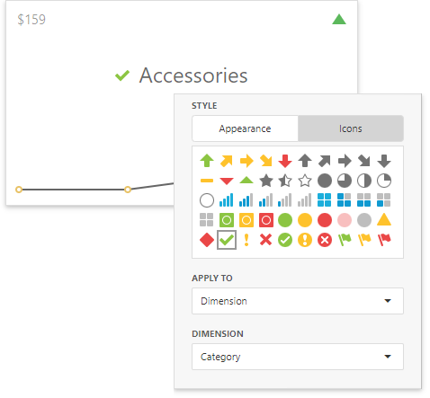
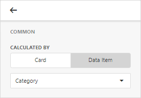

# Conditional Formatting 

Use conditional formatting to change the background color of the card or to highlight individual card elements (such as title or value).

> [!Note]
> Cards that use a [legacy layout](https://docs.devexpress.com/Dashboard/118608/create-dashboards/create-dashboards-on-the-web/dashboard-item-settings/cards/layout#legacy-layout-v162-and-earlier) do not support conditional formatting.

## Supported Format Rules

Format rules that can be applied to different data item types are as follows:
* numeric 
	* **Value**
	* **Top-Bottom**
	* **Average**
	* **Expression** 
	* **Icon Ranges**
	* **Color Ranges**
	* **Gradient Ranges**
* string 
	* **Value** (with the condition type set to _Equal To_, _Not Equal To_ or _Text that Contains_)
	* **Expression**
* date-time 
	* **Value**
	* **A Date Occurring** (for dimensions with a continuous date-time group interval)
	* **Expression**
	* **Icon and Color Ranges**
	* **Color Ranges**
	* **Gradient Ranges**

Refer to the following topic for more information about format condition types: [Conditional Formatting in Web Dashboard](../../appearance-customization/conditional-formatting.md).
## Create and Edit a Format Rule   

You can create and edit format rules in the **Conditional Formatting** section that is located in the following places:

* The dashboard item's [Options](../../ui-elements/dashboard-item-menu.md) menu

* The [data item menu](../../ui-elements/data-item-menu.md)

Refer to the following topic for information on how to create and edit format rules: [Conditional Formatting in Web Dashboard](../../appearance-customization/conditional-formatting.md).

## Appearance Settings

You can add an icon to the [card layout element](../../dashboard-item-settings/cards/layout.md) or configure the style for display text or background color. To do this, open the format rule's **Condition** section and specify the settings:

* **Appearance**
  
	You can select a predefined style or create a *Custom Style* in the **Appearance** tab. You can specify background color, text color, and font settings.

	The background color applies to the entire card. Text settings allow you to specify a target element.

	

* **Icons**
  
	You can select an predefined icon from the **Icon** tab.

	The image below displays the result of the format rule that adds the green check icon to the _Category_ dimension layout element:

	

## Card-Specific Format Condition Settings

Available settings in the **Common** section depend on the selected **Calculated by** option:

* **Card**
  
	The **Card** option specifies a data item container (a [card](../../dashboard-item-settings/cards/providing-data.md)) whose values are used to calculate the format rule. The **Value Type** field allows you to pre-process the card's value before it takes part in calculations. 

	

	If a dashboard item contains multiple cards, apply a format rule to the active card to see changes. To switch between cards, click the **Values** button in the dashboard item caption. Note that the expression format condition applies to all cards regardless of the specified card.

* **Data Item**
  
	For the **Data Item** option you can choose a hidden measure or series dimension. The rule applies to all cards in a Card item.

	

To apply the appearance settings to the certain card layout element, use the drop-down **Apply to** list. The _All elements_ value applies the format rule to all card elements.
