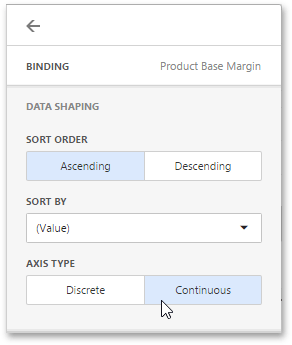

# Axes
The Chart dashboard item displays two axes by default: the X-axis and the Y-axis. The X-axis is the axis of arguments and the Y-axis is the numerical axis of values.

## Axis X
To access X-axis settings, go to the Chart's [Options](../../ui-elements/dashboard-item-menu.md) menu and open the **Axis X** section.

You can configure the following settings.

* The **Reverse** option allows you to reverse an X axis. If the X axis is reversed, its values are ordered from right to left.
* The **Visible** option specifies whether the axis is visible.
* The **Title** option specifies the X axis's title. Use the **Title Text** field to set the title.
* The **Enable Zooming** option allows you to enable zooming for the X axis.
* The **Limit Visible Points** option allows you to limit the number of visible points. The **Visible Points Count** field allows you to specify the maximum number of visible points.

### Continuous and Discrete X-Axes

If the dimension in the Arguments section contains numeric data, the Chart can create either a continuous X-axis or a discrete X-axis.

If a continuous axis is used, the distance between argument values is proportional to their values. On a discrete axis, all argument values are an equal distance from each other.

To specify the X-axis type in the Web Dashboard, go to the data item [Data Shaping](../../ui-elements/data-item-menu.md) menu for the argument dimension and select the axis type. The image below illustrates how to change this setting for the _Product Base Margin_ data item.

## Axis Y
To access Y-axis settings, go to the Chart's [Options](../../ui-elements/dashboard-item-menu.md) menu and open the **Axis Y** section for a corresponding pane.

* The **Always Show Zero Level** option allows you to indicate whether or not an axis zero value should be displayed.
* The **Reverse** option allows you to reverse an Y-axis. If the Y-axis is reversed, its values are ordered from right to left.
* The **Grid Lines** options allows you to control the visibility of the reference lines used to improve the readability of a chart's visual data.
* The **Visible** option specifies whether the axis is visible.
* The **Title** option specifies the Y-axis's title. Use the **Title Text** field to set the title.
* The **Logarithmic Scale** option allows you to use a log scale to display Y-axis. Use the **Logarithmic Scale Base** field to set a log scale base.

### Secondary Axis

The secondary Y-axis is useful when it is necessary to visually combine several charts into one. Secondary axes provide the ability to plot series with different ranges on the same chart.

To plot the required series using the secondary axis, go to the data item [Options](../../ui-elements/data-item-menu.md) menu for the value measure and turn the **Plot on Secondary Axis** option on.