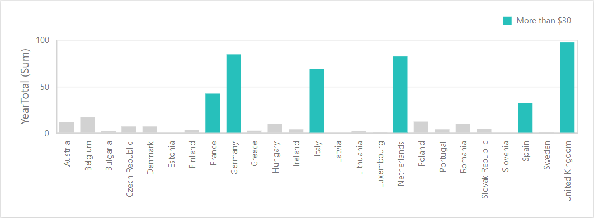
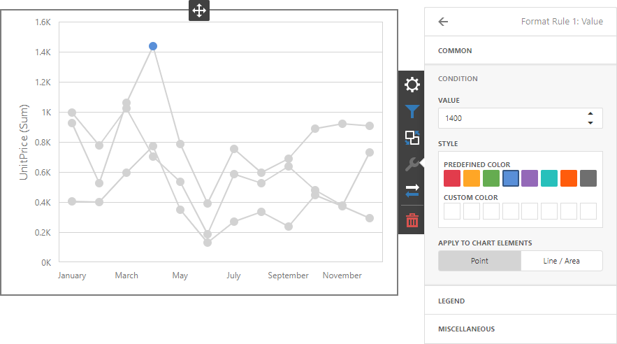
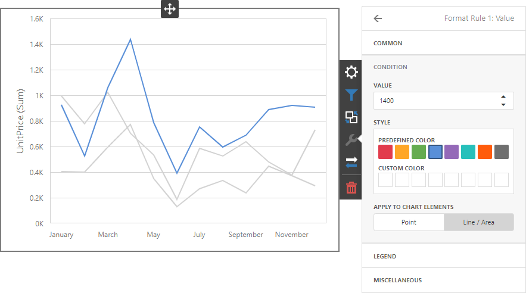
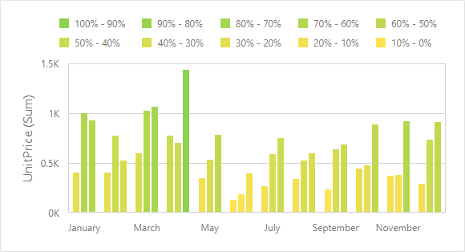
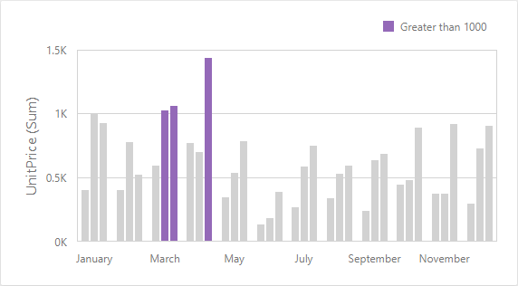
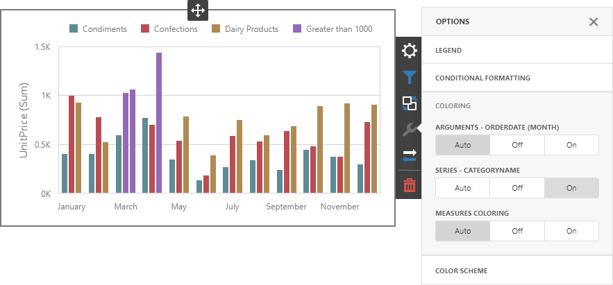

# Conditional Formatting

Use conditional formatting to highlight chart elements such as bars, lines, areas, and data points.

The following [series types](series.md) support conditional formatting:

* Bar
* Point/Line
* Area
* Bubble 
* Range Bar

## Supported Format Rules

You can use the following data in rule calculations:

- [measures](../../bind-dashboard-items-to-data/bind-dashboard-items-to-data-in-the-web-dashboard.md) from the **Values** section 
- [dimensions](../../bind-dashboard-items-to-data/bind-dashboard-items-to-data-in-the-web-dashboard.md) from the **Arguments**/**Series** section 
- [hidden measures](../../bind-dashboard-items-to-data/hidden-data-items.md) 

Format conditions that can be applied to different data item types are as follows:
* numeric 
	* **Value**
	* **Top-Bottom**
	* **Average**
	* **Expression** 
	* **Color Ranges**
	* **Gradient Ranges**
* string 
	* **Value** (with the condition type set to _Equal To_, _Not Equal To_ or _Text that Contains_)
	* **Expression**
* date-time 
	* **Value**
	* **A Date Occurring** (for dimensions with a continuous date-time group interval)
	* **Expression**
	* **Color Ranges**
	* **Gradient Ranges**

Refer to the following topic for more information about format condition types: [Conditional Formatting in Web Dashboard](../../appearance-customization/conditional-formatting.md).

## Create and Edit a Format Rule   

You can create and edit format rules in the **Conditional Formatting** section that is located in the following places:

* The dashboard item's [Options](../../ui-elements/dashboard-item-menu.md) menu

* The [data item menu](../../ui-elements/data-item-menu.md)

Refer to the following topic for information on how to create and edit format rules: [Conditional Formatting in Web Dashboard](../../appearance-customization/conditional-formatting.md).

## Chart-Specific Format Condition Settings

Specify appearance settings and set the condition's value to create a format rule. Available settings depend on the selected format condition type.

The image below displays the **Value** rule settings. The condition colors points/bars if their values exceed 1400.

You can apply one of the predefined colors or set a custom color for this condition.

Use the **Apply to chart elements** button group to apply a rule to points or lines.

* **Point**: A rule applies to the data points such as bars, points and bubbles.
* **Line / Area**: A rule applies to lines and areas.

If you select **Line / Area**, the format rule applies to the line when at least one line point meets the rule's condition: 

Go to the rule's **Legend** section and set the **Caption** field to specify the legend's text. It enables the **Display in Legend** option and the Chart item displays information about the applied rule in the legend.

For Range format rules, the legend display text is generated automatically and depends on range intervals:

## Coloring

A Chart item paints elements in pale gray if they do not meet the applied format condition. Note that this does not apply to elements that are painted by different hues.

Enable coloring for series to restore the color scheme:

> [!Tip]
> **Documentation:**
> [Web Dashboard - Coloring](../../appearance-customization/coloring.md)
