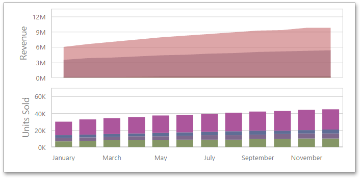

# Panes
Panes are visual areas within a diagram that display chart series. The Chart dashboard item can contain any number of panes.

Each pane has its own **Y-axis** and displays a specific set of series. All panes in a chart share the same **X-axis**.

## Add Panes
To add a pane, click the **Add Pane** button in the Chart's data item section.

Once a new pane is added, the Web Dashboard creates another Values section. Use this section to provide data items that supply values to be displayed in the new pane (see [Providing Data](providing-data.md) for details on data binding).

To remove a pane, click the **Remove Pane** button displayed in the added Values section.