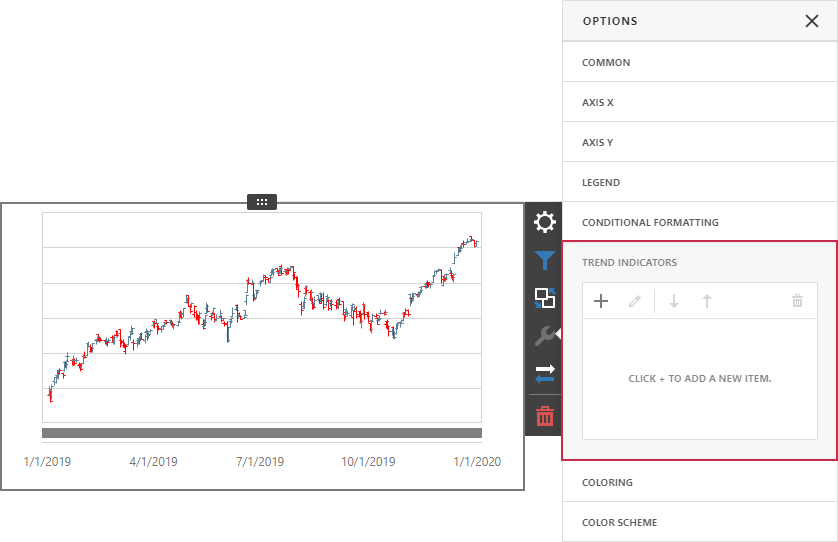
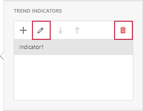

# Trend Indicators

The Web Dashboard allows you to display predefined trend indicators in Chart dashboard items. 

Trend indicators are statistical tools used to analyze data and identify patterns or relationships between variables.

The following indicator types are available:

* Trend Line

    Displays the general direction of associated points. It is often used to identify existing data trends and can help forecast future trends.
* Regression Line

    Visualizes data using a mathematical formula that minimizes the distance between the line itself and associated data points. It is used to model the relationship between two variables and can be used to make predictions about one variable based on the value of another.
* Custom Indicator

    A custom indicator type registered in a dashboard.

## Create a Trend Indicator 

Click **Trend Indicators** in the **Options** dialog to open the **Trend Indicators** editor.

Click “+” to add a new trend indicator. The new indicator is generated with the default settings and automatically displayed in a chart dashboard item:

You can change the following indicator settings:

* Name

   The name of the trend indicator within the indicators collection.

* Type

   The indicator type: Trend Line, Regression Line, or any registered Custom Type.

* Value

   The measure data item that is used to calculate the trend indicator.
  
* Value Level

	The value that specifies which series point value should be used to calculate the indicator.

* Display In Legend

	Specifies whether to display the trend indicator in the legend.

* Legend Text

	The text that identifies the trend indicator within the legend.

* Dash Style

	The dash style used to paint the line.
 
* Thickness

	The thickness of the indicator line.
  
* Color

	 The color for the trend indicator.

* Visible

	Specifies whether to display the trend indicator.

In the editor, select an indicator and click **Edit** or **Delete** to edit or delete the selected item.

