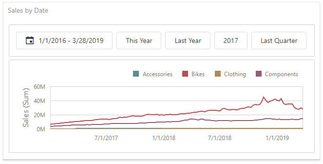
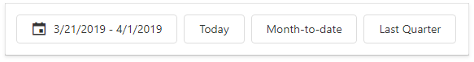
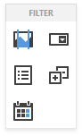
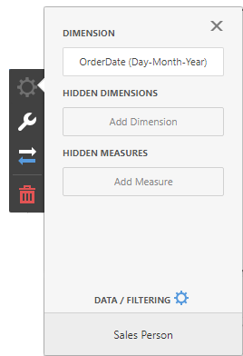
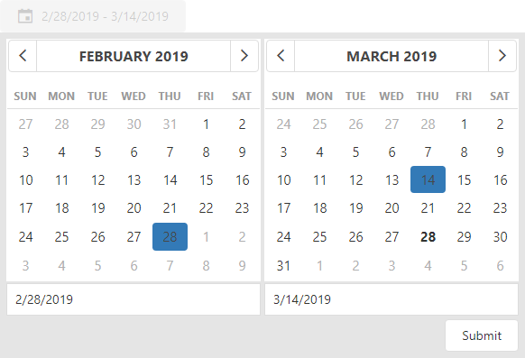
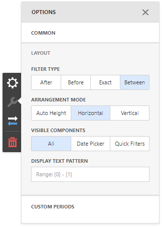
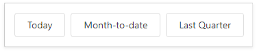
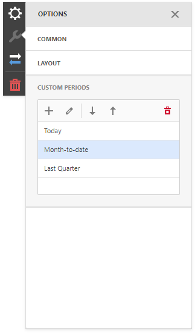
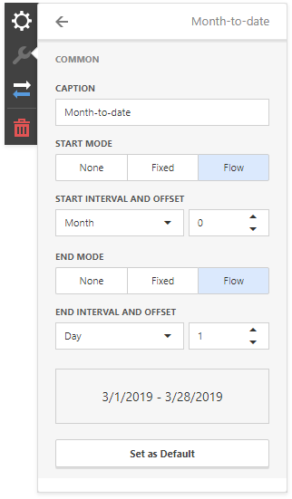

# Date Filter

The **Date Filter** dashboard item allows you to filter dashboard data based on the selected data range. The range can be relative (Last 3 Months), use fixed dates (01-01-2018), or presets (Month-to-date). You can also filter dates before or after a specified date. 

The Date Filter item displays a set of intervals that can be used as quick filters:

## Add a New Date Filter to the Dashboard

To create a Date Filter item, click the **Date Filter** item (the    icon) in the [Toolbox](../ui-elements/toolbox.md) **Filter** section:

## Bind to Data

Click the **Dimension** placeholder in the data section and select the required data source field in the **Binding** section of the invoked [data item menu](../ui-elements/data-item-menu.md) to bind the Date Filter to data.

For details, see the [Bind Dashboard Items to Data](../bind-dashboard-items-to-data.md) topic.

## Date Picker

The Date Filter item displays a **Date Picker** that is a button with a drop-down calendar. A drop-down calendar allows the end-user to select a single date or a date range:

You can configure whether to display the Date Picker in the Date Filter item. For this, go to the Date Filter's [Options](../ui-elements/dashboard-item-menu.md) menu, open to the **Layout** section and specify the **Show Date Picker** setting.

## Display Format

To specify the date-time value format, use the **Format Type** option in the **Format** section of the [data item menu](../ui-elements/data-item-menu.md), as described in the Formatting Data topic.

To specify a custom string displayed in the Date Picker component, go to the dashboard item [Options](../ui-elements/dashboard-item-menu.md) menu, open the **Layout** section and fill in the **Display Text Pattern** text field:

You can include placeholders in a custom string. The `{0}` placeholder is the interval's start, the `{1}` placeholder is the interval's end.

## Create Quick Filters

**Quick Filters** are buttons displayed within the Date Filter item. Each button is bound to a predefined date-time period that can be used to perform a selection. You can click the button to apply a custom period to a Date filter:

The **Select Date Time Period** button displayed in the Date Filter caption invokes the drop-down list with quick filters.

To add quick filters, open the Date Filter's [Options](../ui-elements/dashboard-item-menu.md) menu and go to the **Custom Periods** section. Click "+" to add a new period:

Click the _edit_ icon to invoke the editor's panel and configure a custom period. The following image illustrates how to modify the **Month-to-Date** custom period:

You can specify the following settings for the start/end boundaries:

* **Caption** - Specifies a predefined period caption.
* **Start Mode** - Specifies a mode of the start boundary.
* **End Mode** - Specifies a mode of the end boundary.

The following modes used to set predefined ranges are available:

* **None** - The selection will begin from the start/end of the visible range.
* **Fixed** - Allows you to select a specific date value using the calendar. Use the **Start/End Date** option to set a value.
* **Flow** - Allows you to select a relative date value. The **Interval** option specifies the interval between the current date and the required date. The **Offset** option allows you to set the number of such intervals.

> [!NOTE]
> Note that the **Offset** option can accept **negative** and **positive** values. Negative values correspond to dates before the current date, while positive values correspond to future dates.

## Arrange Quick Filters

Quick filters in the Date Filter item can be arranged horizontally or vertically. The default mode is _auto height_, in which quick filters are displayed horizontally and the dashboard item shrinks automatically to fit the items and save space.

To specify the arrangement mode, go to the dashboard item [Options](../ui-elements/dashboard-item-menu.md) menu, open the **Layout** section and specify the **Arrangement Mode** setting:

