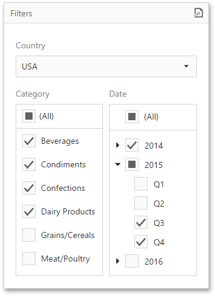

# Filter Elements
Filter elements represent a special type of dashboard item that allows you to apply filtering to other dashboard items.

This section consists of the following topics.
* [Filter Elements Overview](filter-elements/filter-elements-overview.md)
* [Providing Data](filter-elements/providing-data.md)
* [Interactivity](filter-elements/interactivity.md)