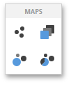

# Map Types Overview
The Web Dashboard allows you to create **three types** of Geo Point maps.
* The [Geo Point Map](geo-point-map.md) dashboard item allows you to place callouts on the map using geographical coordinates.
	
	
* The [Bubble Map](bubble-map.md) dashboard item allows you to place bubbles on the map. Each bubble can represent data using its weight and color.
	
	
* The [Pie Map](pie-map.md) dashboard item allows you to display pies on the map. Each pie visualizes the contribution of each value to the total.
	
	

To create the required **Geo Point Map** dashboard item, use the **Maps** section in the Toolbox.

To learn how to provide maps for Geo Point Map dashboard items, see the [Providing Maps](providing-maps.md) topic.