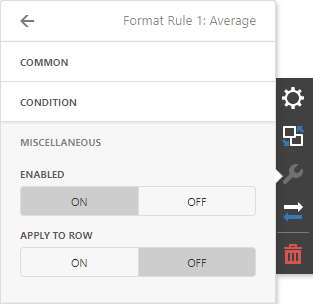

# Conditional Formatting
Use conditional formatting to highlight individual cells or rows based on specific conditions. You can apply format rules to the **dimension** and **measure** [column types](columns.md). You can use [hidden measures](../../bind-dashboard-items-to-data/hidden-data-items.md) to specify a condition used to apply formatting to visible values. 

 

## Supported Format Rules

Format rules that can be applied to different data item types are as follows:
* numeric 
	* **Value**
	* **Top-Bottom**
	* **Average**
	* **Expression**  
	* **Icon Ranges**
	* **Color Ranges**
	* **Gradient Ranges**
	* **Bar** 
	* **Bar Color Ranges** 
	* **Bar Gradient Ranges** 
* string 
	* **Value** (with the condition type set to _Equal To_, _Not Equal To_ or _Text that Contains_)
	* **Expression**
* date-time 
	* **Value**
	* **A Date Occurring** (for dimensions with a continuous date-time group interval)
	* **Expression**
	* **Icon and Color Ranges**
	* **Color Ranges**
	* **Gradient Ranges**
	* **Bar** 
	* **Bar Color Ranges** 
	* **Bar Gradient Ranges** 

Refer to the following topic for more information about format condition types: [Conditional Formatting in Web Dashboard](../../appearance-customization/conditional-formatting.md).

## Create and Edit a Format Rule   

You can create and edit format rules in the **Conditional Formatting** section that is located in the following places:

* The dashboard item's [Options](../../ui-elements/dashboard-item-menu.md) menu

* The [data item menu](../../ui-elements/data-item-menu.md)

Refer to the following topic for information on how to create and edit format rules: [Conditional Formatting in Web Dashboard](../../appearance-customization/conditional-formatting.md).

## Grid-Specific Format Condition Settings

The format rule's **Miscellaneous** section contains the following properties that are specific to the Grid item:

 | Option | Description |
 | -- | --| 
 | **Enabled** | Enables/disables the current format rule. |
 | **Applied to Row** | Applies the current format rule to a row. |
