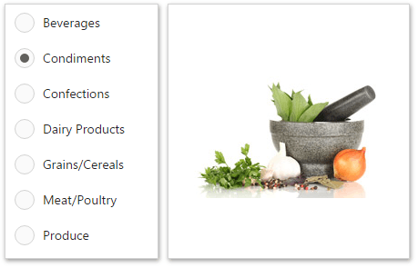

# Image Overview
The Web Dashboard allows you to create two types of **Image** dashboard items.
* The **Image** dashboard item allows you to add a static image to the dashboard.
	
	
* The **Bound Image** dashboard item can be bound to a set of images (for instance, stored in the database). You can use the Bound Image as a detail item along with the [Master Filtering](../../interactivity/master-filtering.md) feature.
	
	

To create a required Image dashboard item, use the **Image** and **Bound Image** buttons in the [Toolbox](../../ui-elements/toolbox.md).

The following topics describe various Image capabilities.
* [Providing Images](providing-images.md) - describes how to load images to Image dashboard items.
* [Interactivity](interactivity.md) - describes interactivity settings of the Bound Image dashboard item.
* [Image Settings](image-settings.md) - describes various settings related to image representation.