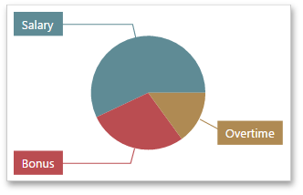

# Style
The Pie dashboard item allows you to select whether diagrams should be painted as **pies** or **donuts**.

To select the diagram style, go to the **Style** section of the Pie's [Options](../../ui-elements/dashboard-item-menu.md) menu and use the **Pie** or **Donut** buttons.

