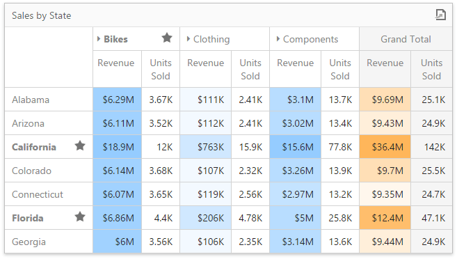

# Pivot
The **Pivot** dashboard item displays a cross-tabular report that presents multi-dimensional data in an easy-to-read format.

This section consists of the following topics.
* [Providing Data](pivot/providing-data.md)
	
	Explains how to supply the Pivot dashboard item with data.
* [Interactivity](pivot/interactivity.md)
	
	Describes features that enable interaction between the Pivot and other dashboard items.
* [Conditional Formatting](pivot/conditional-formatting.md)
	
	Describes the conditional formatting feature that provides the capability to apply formatting to cells whose values meet the specified condition.
* [Layout](pivot/layout.md)
	
	Describes layout options of the Pivot dashboard item.
* [Expanded State](pivot/expanded-state.md)
	
	Describes how to specify whether to expand column/row groups by default.