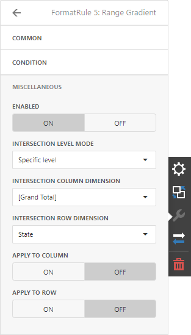
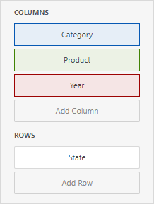
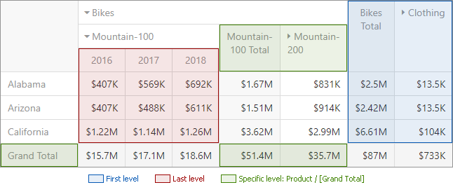

# Conditional Formatting
A Pivot dashboard item highlights cells with a certain color, depending on the cell's value. You can calculate a format rule by measures placed in the **Values** section and dimensions placed in the **Columns** or **Rows** section.

You can use [hidden measures](../../bind-dashboard-items-to-data/hidden-data-items.md) to specify a condition used to apply formatting to visible values. 

## Supported Format Rules

Format rules that can be applied to different data item types are as follows:
* numeric 
	* **Value**
	* **Top-Bottom**
	* **Average**
	* **Expression**  
	* **Icon Ranges**
	* **Color Ranges**
	* **Gradient Ranges**
	* **Bar** 
	* **Bar Color Ranges** 
	* **Bar Gradient Ranges** 
* string 
	* **Value** (with the condition type set to _Equal To_, _Not Equal To_ or _Text that Contains_)
	* **Expression**
* date-time 
	* **Value**
	* **A Date Occurring** (for dimensions with a continuous date-time group interval)
	* **Expression**
	* **Icon and Color Ranges**
	* **Color Ranges**
	* **Gradient Ranges**
	* **Bar** 
	* **Bar Color Ranges** 
	* **Bar Gradient Ranges** 

Refer to the following topic for more information about format condition types: [Conditional Formatting in Web Dashboard](../../appearance-customization/conditional-formatting.md).

## Create and Edit a Format Rule   

You can create and edit format rules in the **Conditional Formatting** section that is located in the following places:

* The dashboard item's [Options](../../ui-elements/dashboard-item-menu.md) menu

* The [data item menu](../../ui-elements/data-item-menu.md)

Refer to the following topic for information on how to create and edit format rules: [Conditional Formatting in Web Dashboard](../../appearance-customization/conditional-formatting.md).

## Pivot-Specific Format Condition Settings

New appearance settings are applied to data cells that correspond to a row/column intersection. You can set a new intersection of the row and column or use predefined settings.

Note the following specifics:

1. The dashboard does not calculate format rules in a pivot item for percentage values at multiple levels. In this case, the "All Levels" intersection mode is not available.
2. If you create a new format rule for a dimension from the Columns/Rows section, the corresponding format condition dialog does not contain any Pivot-specific settings.

The format rule's **Miscellaneous** section contains pivot-specific options:

| Option | Description |
| --|--|
| **Enabled** | Enables/disables the current format rule. |
| **Intersection Mode** | Specifies the level at which to apply conditional formatting to pivot cells. |  
| **Intersection Row/Column Dimension**  | Applies the format rule to the specified row/column dimension, if you select the _Specific Level_ as the intersection mode.|
| **Apply to Row/Column** | Specifies whether to apply the formatting to the Pivot item's entire row/column.

A Pivot item allows you to specify the field intersection to which a format rule is applied.

| Intersection Level Mode| Description |
| --|--|
| _Auto_ | Identifies the default level. For the Pivot dashboard item, _Auto_ identifies the First Level. |
| _First Level_ |The first level values are used to apply conditional formatting. |
| _Last Level_ | The last level values are used to apply conditional formatting. |
| _All Levels_ | All pivot data cells are used to apply conditional formatting. |
| _Specific Level_ | The specified measures/dimensions are used to apply conditional formatting. |

For example, the Pivot item has three fields in the column area (_Year_, _Category_, and _Product_) and one field in the row area (_State_):

The image below displays different intersection levels with the applied format rule:

To apply a format rule to the row or column Grand Total, change the **Intersection Level Mode** to _Specific level_ and set the _[Grand Total]_ value as the intersection row/column dimension.  
