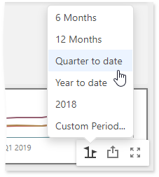

# Interactivity
This document describes the features that enable interaction between the Range Filter and other dashboard items. These features include Master Filtering.

## Master Filtering
The Dashboard allows you to use any data-aware dashboard item as a filter for other dashboard items.

**Master filtering** is always enabled for the Range Filter dashboard item. The Range Filter displays a chart with selection thumbs that allow you to filter out values displayed along the argument axis.

The Range Filter supports the **Ignore Master Filters** and **Cross Data Source Filtering** options. To learn more, see the [Master Filtering](../../interactivity/master-filtering.md) topic.

## Predefined Periods
The Range Filter dashboard item allows you to add a number of _predefined date-time periods_ that can be used to perform a selection.

To learn more about predefined periods, see [Predefined Periods](predefined-periods.md).