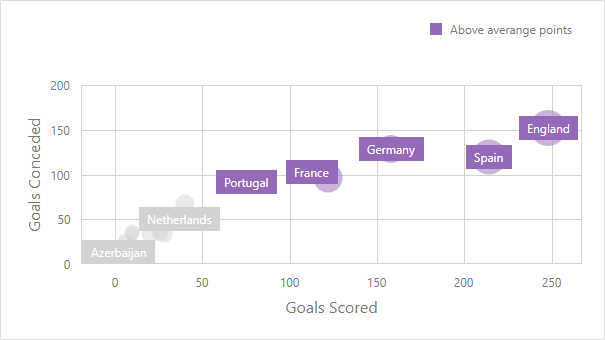
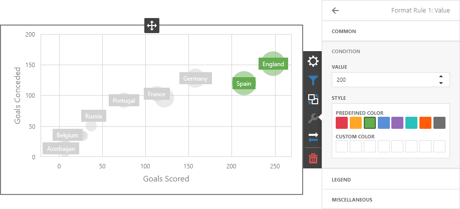
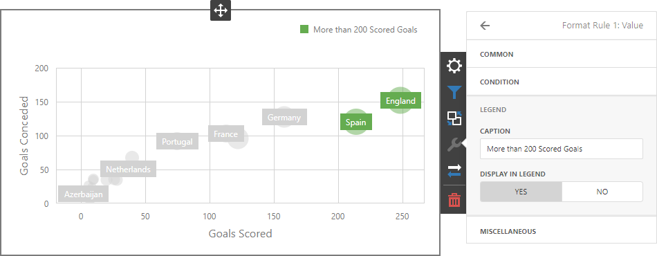
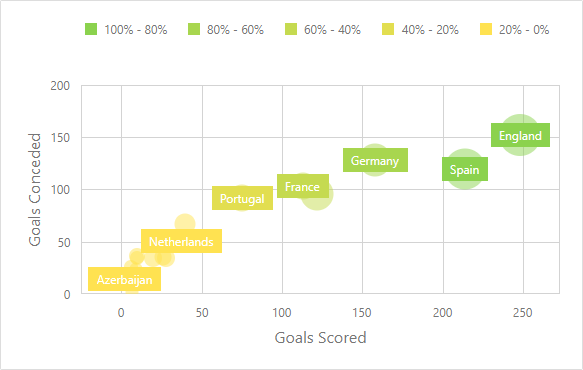
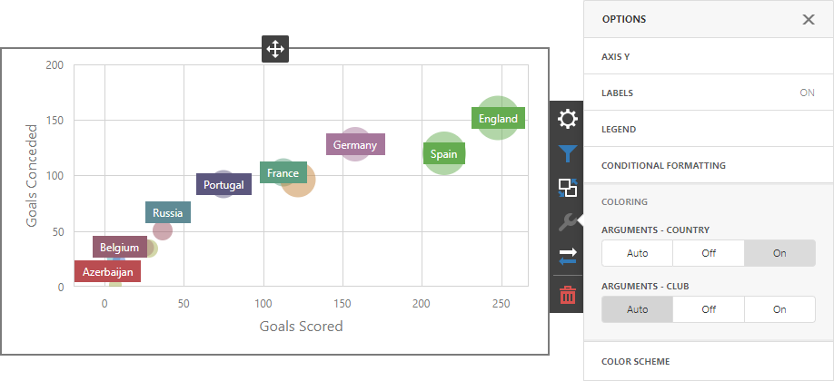

# Conditional Formatting

Use conditional formatting to highlight points in a Scatter Chart dashboard item.

## Supported Format Rules

You can use the following data in rule calculations:

- [measures](../../bind-dashboard-items-to-data/bind-dashboard-items-to-data-in-the-web-dashboard.md) from the **X and Y axis** sections 
- [measures](../../bind-dashboard-items-to-data/bind-dashboard-items-to-data-in-the-web-dashboard.md) from the **Weight** section
- [dimensions](../../bind-dashboard-items-to-data/bind-dashboard-items-to-data-in-the-web-dashboard.md) from the **Arguments** section 
- hidden measures 

Format conditions that can be applied to different data item types are as follows:
* numeric 
	* **Value** 
	* **Top-Bottom**
	* **Average**
	* **Expression** 
	* **Color Ranges**
	* **Gradient Ranges**
* string 
	* **Value** (with the condition type set to _Equal To_, _Not Equal To_ or _Text that Contains_)
	* **Expression**
* date-time 
	* **Value**
	* **A Date Occurring** (for dimensions with a continuous date-time group interval)
	* **Expression**
	* **Color Ranges**
	* **Gradient Ranges**

Refer to the following topic for more information about format condition types: [Conditional Formatting in Web Dashboard](../../appearance-customization/conditional-formatting.md).

## Create and Edit a Format Rule 

You can create and edit format rules in the **Conditional Formatting** section that is located in the following places:

* The dashboard item's [Options](../../ui-elements/dashboard-item-menu.md) menu

* The [data item menu](../../ui-elements/data-item-menu.md)

Refer to the following topic for information on how to create and edit format rules: [Conditional Formatting in Web Dashboard](../../appearance-customization/conditional-formatting.md).

## Format Condition Settings Specific to Scatter Charts

Specify appearance settings and set the condition's value to create a format rule. Available settings depend on the selected format condition type.

The image below displays the **Value** rule settings. The condition colors bubbles if their weight exceeds 200.

You can apply one of the predefined colors or set a custom color for this condition.

Go to the rule's **Legend** section and set the **Caption** field to specify the legend's text. It enables the **Display in Legend** option and the Scatter Chart item displays information about the applied rule in the legend.

The image below displays the Scatter Chart item with the applied **Greater Than** format rule. The **Display in Legend** option is activated and the rule's caption is displayed in the legend:

For Range format rules, the legend display text is generated automatically and depends on the range intervals:

## Coloring 

A Scatter Chart item paints elements in pale gray if they don't meet the applied format condition. Note that this doesn't apply to elements that are painted by different hues.

Enable coloring for arguments to restore the color scheme:

> [!Tip]
> **Documentation:**
> [Web Dashboard - Coloring](../../appearance-customization/coloring.md)
