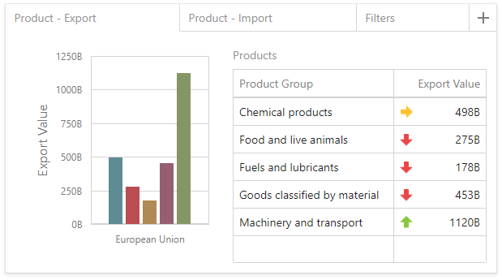
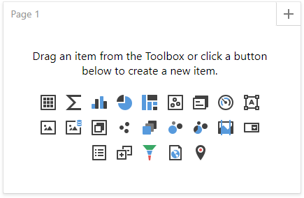
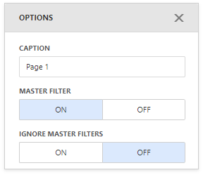

# Tab Container

Like the [Dashboard Item Group](dashboard-item-group.md), the **Tab Container** dashboard item allows you to combine elements within a dashboard. The main Tab Container's purpose is to split the dashboard layout into several pages. For example, you can place common filter elements on a separate tab page to display only data dashboard items. 

- [Create a Tab Container](#create-a-tab-container)
- [Interactivity](#interactivity)

## Create a Tab Container
To create a tab container, use the **Tab Container** button (the  icon) in the [Toolbox](../ui-elements/toolbox.md). The created tab container always contains one empty tab page (_Page 1_).

Click the **Add page** button (the  icon) to add a new page to the tab container.

A tab page can contain [dashboard items](../dashboard-item-settings.md) and [dashboard item groups](dashboard-item-group.md). You can add them to a tab page using one of the following ways:

* Create a new item using the buttons inside the empty tab page.
* Drag a new item from the [Toolbox](../ui-elements/toolbox.md) and drop it to the tab page.
* Use [drag-and-drop](../dashboard-layout/dashboard-items-layout.md) to move existing items to the tab page.

> [!NOTE]
> Tab containers cannot be added to another tab container.

## Interactivity

The tab page allows you to manage the [interaction](../interactivity/master-filtering.md) between dashboard items inside and outside the page. 

The image below shows a tab page's default interactivity settings:

The **Master Filter** button controls whether the current tab page allows you to filter dashboard items outside the page using master filter items contained within the page. By default, this option is enabled: master filter items in the page can filter any dashboard items.

The **Ignore Master Filters** button allows you to isolate dashboard items contained within the tab page from external master filter items. By default, this option is disabled: external master filter items can filter the dashboard items contained within the tab page.