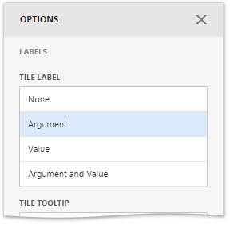

# Labels
The Treemap displays labels that contain descriptions for tiles and groups, and provide tooltips with additional information.

You can specify which information should be displayed within tile and group labels separately. To do this, go to the **Labels** section of the Treemap's [Options](../../ui-elements/dashboard-item-menu.md) menu. Here you can specify a type of the following elements.
* Tile labels
* Tile tooltips
* Group labels
* Group tooltips

The available types are similar for all elements. You can set one of these types.

