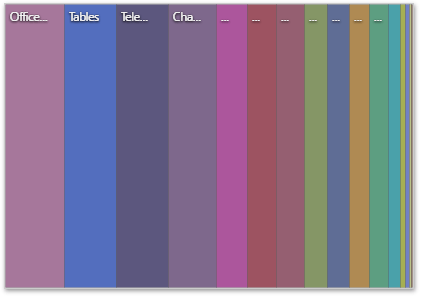

# Layout
This topic describes how to change a layout algorithm used to arrange Treemap tiles. To do this in the Web Dashboard, go to the Treemap's [Options](../../ui-elements/dashboard-item-menu.md) menu  and open the **Layout** section.

## Layout Algorithm
To change a layout algorithm, select the required direction in the Layout Algorithm list. The following algorithms are available.
* The **Slice and Dice** algorithm divides the space between items, slicing it in the specified direction depending on item value.
	
	
* The **Squarified** algorithm arranges tiles so that their width/height ratio will be closer to 1.
	
	
* The **Striped** algorithm is a modified version of the Squarified algorithm. The difference here is that tiles are drawn side by side as columns or rows.
	
	

## Layout Direction
You can also set a layout direction to specify an arrangement of tiles depending on their sizes. The Treemap arranges tiles in descending order from maximum to minimum values. To do this, select the required direction in the **Layout Direction** list.
* **Bottom Left - Top Right** arranges tiles from the bottom-left to the top-right corner.
* **Bottom Right - Top Left** arranges tiles from the bottom-right to the top-left corner.
* **Top Left - Bottom Right** arranges tiles from the top-left to the bottom-right corner.
* **Top Right - Bottom Left** arranges tiles from the top-right to the bottom-left corner.