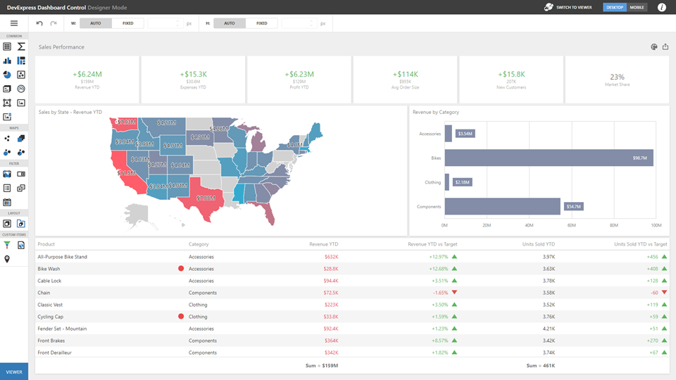

# Dashboard Layout

This section describes the features related to the dashboard layout.

## Dashboard Width and Height

The control automatically stretches or shrinks content (dashboard items) in a dashboard to fit available screen space horizontally and vertically. You can adjust layout options and specify exact content width and height.

As an alternative, you can set content size in pixels. If the width or height is too large, the Dashboard control displays a scrollbar.

Specify the following options in the Designer Toolbar:

* _Auto_

    The height or width of a dashboard surface fits to content.
* _Fixed_

    The height or width of a dashboard surface is set in pixels.

### Layout Size Best Practices 

You may have two scroll bars in your application: on the HTML page and inside the dashboard control. We recommend that you design the application layout to avoid HTML page scrolling because it can lead to UI issues when the control operates in Designer mode:
- The size of pop-up elements like message boxes and item menus are based on the height and width of the dashboard control. Those elements can be hidden if the control do not fit the page's visible area.
- When the dashboard's size is larger than the control's size, the control scrolls the dashboard surface so you can place dashboard items in any position. Auto scrolling in drag-and-drop operations can only be used to scroll a dashboard and does not affect page scrolling.

Instead, keep dashboard controls in the visible area of the HTML page:

In Viewer mode, you can programmatically adjust the size of the control to fit a dashboard:

## Dashboard Title
The Dashboard Title is located at the top of the [dashboard surface](ui-elements/dashboard-surface.md) and can contain static text, svg images, and command buttons. These elements are called toolbar items:

Refer to the following article for details: [Dashboard Title](dashboard-layout/dashboard-title.md).
## Dashboard Items Layout
The dashboard arranges dashboard items and groups using layout items and layout groups. They are containers that display a dashboard layout as a hierarchical structure.

See the following article for more information: [Dashboard Items Layout](dashboard-layout/dashboard-items-layout.md).
## Dashboard Item Caption

Each dashboard item has a caption that is displayed at the top of this item. The caption can contain static text, svg images, and command buttons. These elements are called toolbar items:

See the following article for more information: [Dashboard Item Caption](dashboard-layout/dashboard-item-caption.md).

