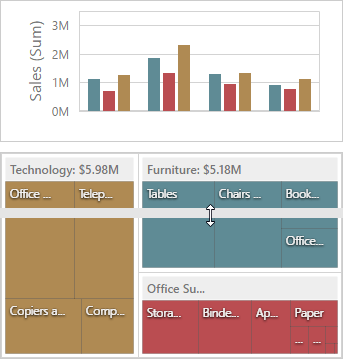
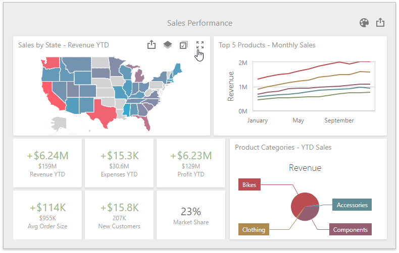
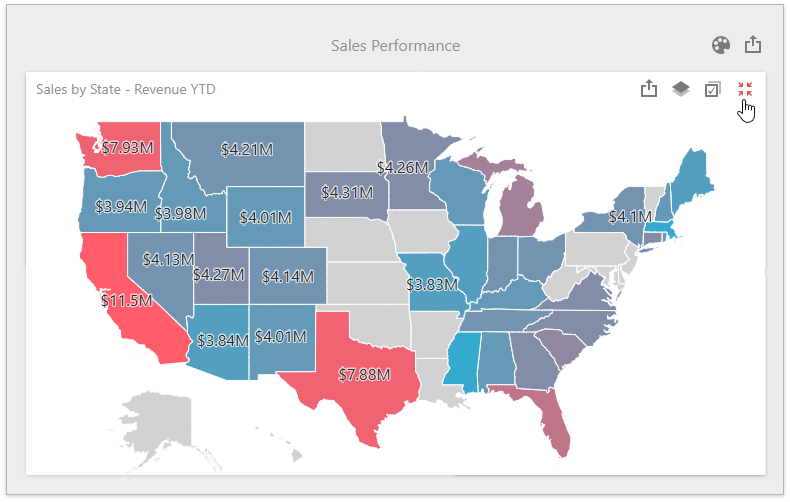

# Dashboard Items Layout
The **Web Dashboard** provides the capability to arrange and resize dashboard items and groups using simple drag-and-drop operations.

- [Layout Concepts](#layout-concepts)
- [Item Resizing](#item-resizing)
- [Maximize and Restore Item](#maximize-and-restore-item)
- [Item Positioning](#item-positioning)

## Layout Concepts
The dashboard arranges dashboard items and groups using _layout items_ and _layout groups_. They are special containers that are used to present a dashboard layout as a hierarchical structure.
* A **layout item** is used as a container that displays an individual dashboard item.
* A **layout group** is used as a container that is used to arrange layout items (or other layout groups) either horizontally or vertically. At the same time, layout groups are used as containers that display dashboard item groups.

Thus, a dashboard layout is hierarchically arranged from the root layout group to bottommost layout items, which display individual dashboard items.

## Item Resizing
You can resize individual items/groups of items by dragging their edges. For this, follow the steps below.
1. In the area allowing you to resize items, cursor types will be changed to **column resize** / **row resize**.
	
	
2. Left-click and drag the cursor until you get the expected sizes and release the left mouse button.
	
	
3. The dashboard items change their sizes.
	
	

## Maximize and Restore Item
You can expand any dashboard item to fit the dashboard to examine data in greater detail. The expanded dashboard item size in this case is the same as the root layout group.

1. Click the **Maximize** button in the [dashboard item caption](dashboard-item-caption.md) to maximize a dashboard item.

	

2. Click **Restore** to restore the item's size.

	

## Item Positioning
You can change the position of a dashboard item by using drag-and-drop and the dashboard item's [Move](../ui-elements/dashboard-item-menu.md) button.

Depending on the required dashboard item position, a new layout group is created (if required) to maintain the arrangement of items. Thus, the dashboard item can be inserted to the desired area of a new or existing dashboard layout group.

The following steps illustrates how a dashboard item is dragged.
1. Select a dashboard item and hover the [Move](../ui-elements/dashboard-item-menu.md) button.
	
	
2. Drag the dashboard item to the expected area and release the left mouse button when the drop indicator displays the required area.
	
	
3. The dashboard item is moved to a new position.
	
	