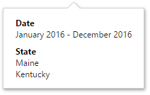

# Dashboard Title
The **Dashboard Title** is located at the top of the [dashboard surface](../../../../dashboard-for-web/articles/web-dashboard-designer-mode/ui-elements/dashboard-surface.md) and can contain text and image content.

To change title settings, invoke the [dashboard menu](../../../../dashboard-for-web/articles/web-dashboard-designer-mode/ui-elements/dashboard-menu.md) and open the **Title** page.

Here you can specify the following options.
* **Text** - Specifies the dashboard title text.
* **Visible** - Specifies whether or not the dashboard title is visible.
* **Alignment** - Specifies the alignment of the dashboard title.
* **Include Master Filter** - Specifies whether or not to show the state of master filter items in the dashboard title. 
	
	When you hover over the filter icon (), all master filters applied to the dashboard are displayed in the invoked popup.
	
	
* **Image** - Allows you to specify the image displayed within the dashboard title. The dashboard definition will contain an image as a byte array.

The dashboard title can contain the following command buttons.
* **Export To** - Allows you to export the entire dashboard. To learn more about exporting, see [Exporting](../../../../dashboard-for-web/articles/web-dashboard-designer-mode/exporting.md).
* **Parameters** - Allows you to modify dashboard parameter values. To learn more about parameters, see [Parameters](../../../../dashboard-for-web/articles/web-dashboard-designer-mode/data-analysis/dashboard-parameters.md).