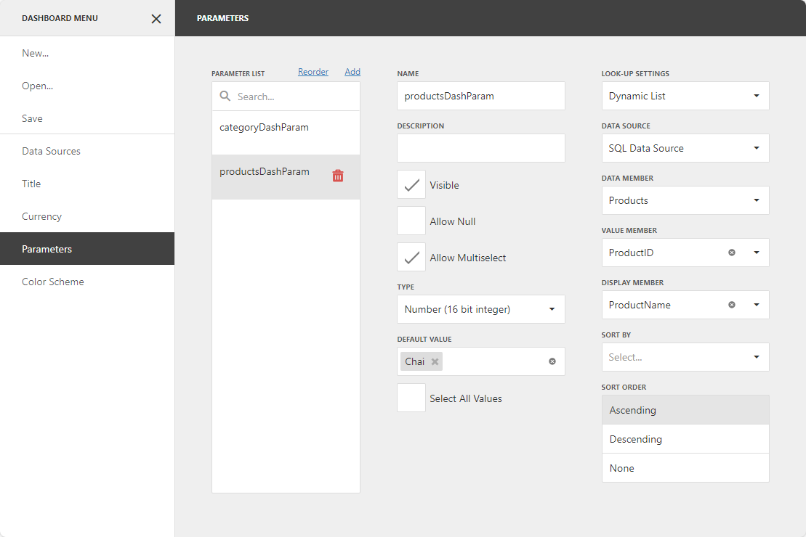

# Cascading Parameters

Create cascading parameters to filter a list of predefined parameter values based on values of another parameter. The following image illustrates cascading parameters where **Products** parameter values are filtered by the selected **Category**:


In case of two parameters, the first parameter is used to filter the data source for the second parameter with [dynamic list](creating-parameters.md#look-up-settings) settings.

## Create Cascading Parameters

The dashboard in this example is connected to a Northwind database (an SQL Database) and contains three [queries](../../provide-data/working-with-sql-data-sources/manage-sql-queries.md): *Categories*, *Products*, and *OrderReports*. The Grid item visualizes data from the *OrderReports* query.

In this tutorial, you will create two dashboard parameters: 
* The **categoryDashParam** parameter filters the *Products* query. The *Products* query is a data source for the **productsDashParam** parameter. 
* The **productsDashParam** parameter filters the *OrderReports* query.  

The steps below create cascading parameters in the Web Dashboard:

1. [Create a dashboard parameter](creating-parameters.md) called **categoryDashParam** with dynamic list settings. Use the *Categories* query as a data member and the *CategoryID* field as a value member. 

    The parameter settings may look as follows:

    

2. [Filter](../../provide-data/working-with-sql-data-sources/filter-queries.md) the *Products* query. 
   
   To do this, click the **Edit** button next to the query on the **Data Sources** page of the [dashboard menu](../../ui-elements/dashboard-menu.md).
   
   
   
   Click **Run Query Builder** in the opened window. 
   
   In the invoked [Query Builder](../../ui-elements/dialogs-and-wizards/query-builder.md), click the ellipsis button next to the **Filter** field in the **Query Properties** section:

    

   
   In the [Filter Editor](../../ui-elements/dialogs-and-wizards/filter-editor.md), specify the filter criteria. From the drop-down list select *Parameter* and create a new [query parameter](../../provide-data/working-with-sql-data-sources//pass-query-parameters.md) called **categoryQueryParam**:

    

    The resulting filter looks as follows: 

    ```
    [Products.CategoryID] = ?categoryQueryParam
    ```

3. [Bind](creating-parameters.md#look-up-settings) the **categoryQueryParam** query parameter to the **categoryDashParam** dashboard parameter.

    To do this, in the **Parameters** section of the [Query Builder](../../ui-elements/dialogs-and-wizards/query-builder.md) change the parameter’s type to *Expression*. Click the **Value** property’s ellipsis button to specify the dashboard parameter. 

    The query parameter settings look as follows: 

    


4. Create a dashboard parameter called **productsDashParam** with dynamic list settings. Use the *Products* query as a data member and the *ProductID* field as a value member.

    The parameter settings may look as follows:

    
    

5. [Filter](../../provide-data/working-with-sql-data-sources/filter-queries.md) the *OrderReports* query. 
   
   To do this, click the **Edit** button next to the query on the **Data Sources** page of the [dashboard menu](../../ui-elements/dashboard-menu.md), then click **Run Query Builder**. In the invoked [Query Builder](../../ui-elements/dialogs-and-wizards/query-builder.md), click the ellipsis button next to the **Filter** field in the **Query Properties** section.

   In the [Filter Editor](../../ui-elements/dialogs-and-wizards/query-builder.md), specify the filter criteria. From the drop-down list select *Parameter* and create a new [query parameter](../../provide-data/working-with-sql-data-sources/pass-query-parameters.md) called **productsQueryParam**:

    

    The resulting filter looks as follows: 

    ```
    [OrderReports.ProductID] In(?productsQueryParam)
    ```

6. [Bind](creating-parameters.md#look-up-settings) the **productsQueryParam** query parameter to the **productsDashParam** dashboard parameter.

    To do this, in the **Parameters** section in the [Query Builder](../../ui-elements/dialogs-and-wizards/query-builder.md) change the parameter’s type to *Expression*. Click the **Value** property’s ellipsis button to specify the dashboard parameter. 

    The query parameter settings look as follows: 

    


7. Create a Grid item to visualize data from the filtered *OrderReports* query.

>[!TIP]
>When using a [multi-value](creating-parameters.md#allow-multiselect) parameter to filter a query, create the condition with the `Is any of` or `Is none of` operator.
