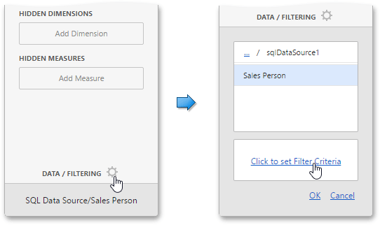
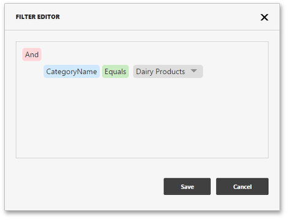

# Filtering
The Web Dashboard allows you to apply filtering for individual dashboard items, filter a [query](../providing-data/working-with-sql-data-sources.md) of the SQL Data Source or the entire Data Source.

This topic describes how to filter data in the dashboard items.

## Apply Filtering
To configure filtering in the Web Dashboard, select the target dashboard item and invoke the dashboard item's [Bindings](../ui-elements/dashboard-item-menu.md) menu. Then, go to the **Data / Filtering** section and use the **Click to set Filter Criteria** button to invoke the Filter Editor dialog.

Use this dialog to build filter criteria with a convenient tree-like interface.

> Note that you can use [hidden dimensions](../binding-dashboard-items-to-data/hidden-data-items.md) within the Filter Editor dialog, allowing you to filter data based on the values.

## Pass Parameter Values
You can use the Filter Editor to filter a data source according to the current parameter value. To learn more, see the [Using Dashboard Parameters](../data-analysis/dashboard-parameters.md) topic.

## OLAP Filtering Specifics
In OLAP mode, you cannot apply filtering by building complex filter criteria. Instead, you can filter dimension attributes and hierarchies by manually selecting the values you wish to include or exclude from the dashboard.

| Dimension Attribute | Dimension Hierachy |
|---|---|
| For dimension attributes, the Filter Editor contains a list of all values. | For hierarchies, a tree is displayed instead, allowing you to filter individual values at any hierarchy level. |
|  |  |