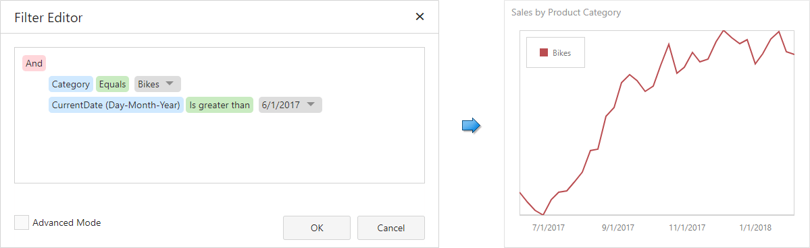
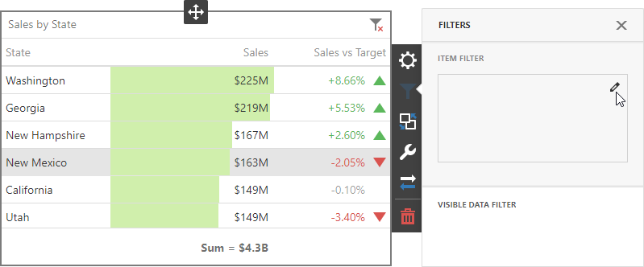
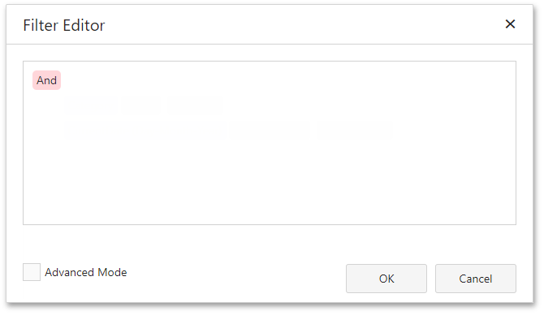
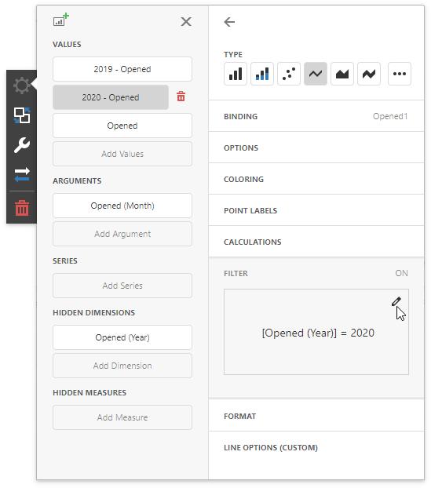
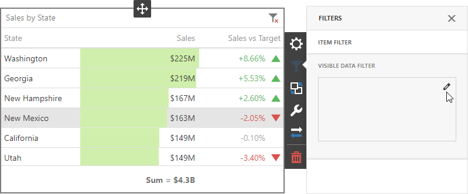
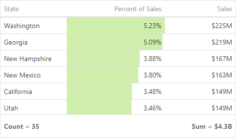
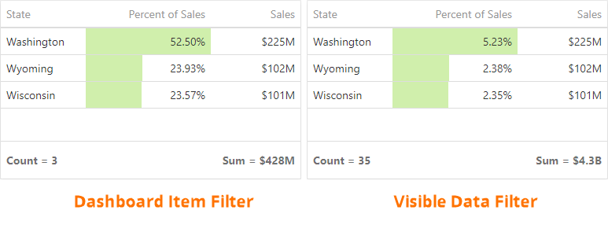
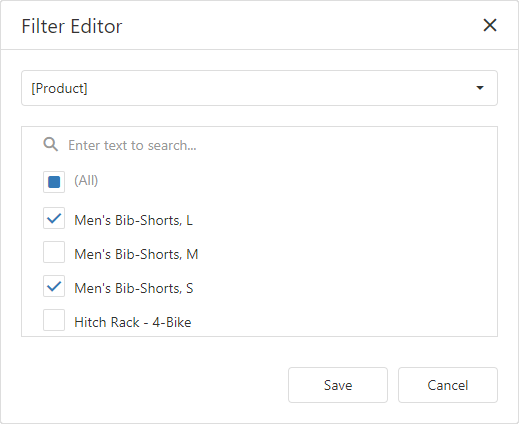
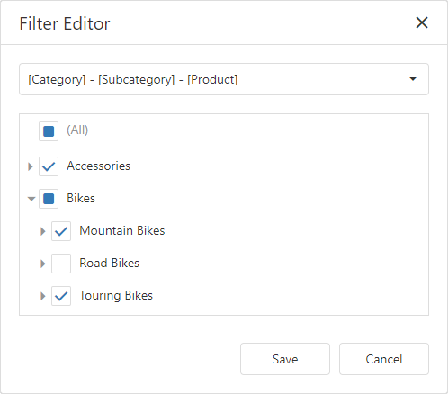

# Filtering
Web Dashboard allows you to filter data in the [dashboard items](../dashboard-item-settings.md) or apply filters to a specific measure. [Dimensions](../bind-dashboard-items-to-data/bind-dashboard-items-to-data-in-the-web-dashboard.md) and [hidden dimensions](../bind-dashboard-items-to-data/hidden-data-items.md) are used to build filter criteria.

## Dashboard Item Filter

Filters that are applied to a dashboard item affect only this item. Open a dashboard item's [Filters](../ui-elements/dashboard-item-menu.md) menu, go to the **Item Filter** section and click **Edit** to add a filter:

This invokes the [Filter Editor](../../../../interface-elements-for-web/articles/report-designer/report-designer-tools/filter-editor.md) dialog where you can specify filter criteria:

> [!Tip]
> **Documentation**: [Filter Editor](../../../../interface-elements-for-web/articles/report-designer/report-designer-tools/filter-editor.md) 

## Measure Filter

You can apply filters to individual [measures](../bind-dashboard-items-to-data/bind-dashboard-items-to-data-in-the-web-dashboard.md). If you create multiple measures that only differ in applied filters, you can compare values calculated over different date-time periods or against different categories.

Open a dashboard item's [Binding](../ui-elements/dashboard-item-menu.md) menu and select a measure to filter. In the invoked [data item menu](../ui-elements/data-item-menu.md), open the **Filter** section and click **Edit**. This invokes the [Filter Editor](../../../../interface-elements-for-web/articles/report-designer/report-designer-tools/filter-editor.md) dialog where you can specify filter criteria. 

> [!Tip]
> **Documentation**: [Filter Editor](../../../../interface-elements-for-web/articles/report-designer/report-designer-tools/filter-editor.md)

You can clear the applied filter in the [data item menu](../ui-elements/data-item-menu.md)'s **Filter** section.

> [!Note]
> The measure filter is technically an expression that uses the `filter(summaryExpression, filterCriteria)` function, where `summaryExpression` is the measure to be filtered and `filterCriteria` is the filter. See the following topic for more information about functions you can use in dashboard expressions: [Expression Constants, Operators, and Functions](../data-analysis/expression-constants-operators-and-functions.md).

The image below shows a Chart with three measures: 

- _2019 - Opened_ is filtered by year 2019.
- _2020 - Opened_ is filtered by year 2020.
- _Opened_ is the original measure without filters.
 

## Visible Data Filter

You can specify a Visible Data Filter to limit displayed data. This filter type does not filter underlying data used in calculations or intermediate level aggregations.

Open a dashboard item's [Filters](../ui-elements/dashboard-item-menu.md) menu, go to the **Visible Data Filter** section and click **Edit** to invoke the Filter Editor, where you can specify a condition:

For example, a Grid dashboard item has 35 rows and displays sales percentages.

The image below shows the difference between filters (the filter condition is the same): 

- **Dashboard Item Filter**: sales percentages are recalculated based on the visible data.
- **Visible Data Filter**: sales percentages remain the same because this filter type does not affect calculations.

## OLAP Filtering Specifics
In OLAP mode, you cannot filter data by building complex filter criteria. Instead, select the values you wish to include in or exclude from the dashboard to filter dimension attributes and hierarchies.

| Dimension Attribute | Dimension Hierarchy |
|---|---|
| For dimension attributes, the Filter Editor contains a list of all values. | For hierarchies, a tree is displayed instead, allowing you to filter individual values at any hierarchy level. |
|  |  |
