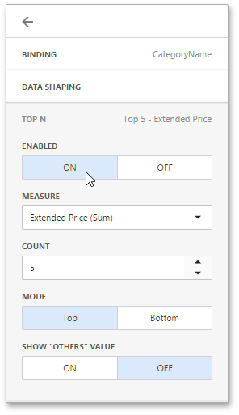

# Top N
The **Top N** feature allows you to display only a limited number of values that correspond to the highest or lowest values of a particular measure.

To enable the Top N feature, open the dashboard item [Bindings](../ui-elements/dashboard-item-menu.md) menu, select a required data item and go to the _Top N_ section.

Click **ON** and specify the following settings.

| Setting | Description |
|---|---|
| **Measure** | The parameter according to which the top or bottom values will be determined. |
| **Count** | The number of values to be displayed. |
| **Mode** | Specifies whether top or bottom values should be displayed. |
| **Show "Others" value** | If enabled, all values that are not the top/bottom ones are consolidated in the "Others" value. Note that this capability is not supported in OLAP mode. |

You can use the [hidden measure](../bind-dashboard-items-to-data/hidden-data-items.md) as a parameter according to which the top or bottom values will be determined.