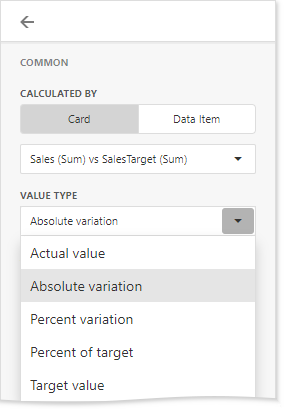

# Conditional Formatting

For the Card dashboard item, you can apply conditional formatting to the card's visual elements (like Title, Subtitle, different values) and change the card's background.

> [!Note]
> Cards that use a [legacy layout](https://docs.devexpress.com/Dashboard/118608/create-dashboards/create-dashboards-on-the-web/designing-dashboard-items/cards/layout#legacy-layout-v162-and-earlier) do not support conditional formatting.

## Create a Format Rule

To create a format rule, open the **Conditional Formatting** section in the dashboard item's [Options](../../ui-elements/dashboard-item-menu.md) menu or in the [data item menu](../../ui-elements/data-item-menu.md). Click "+" to add a new format rule:
	

	
Specify the data item/card used to calculate a condition in the **Common** section. You can also create a format rule for one data item and apply different settings to the other data item. 

Available settings in the **Common** section depend on the selected **Calculated by** option:

* If you select the **Card** option, specify the card by whose values the format rule is calculated. The format rule applies to the [related card](providing-data.md). The **Value Type** option enables you to specify the card's value type according to which a condition is calculated. The **expression** format condition is an exception to this rule and applies to all cards.
* The **Data Item** option allows you to select a hidden measure or a series dimension. The rule applies to all cards in the Card item.

Select a format rule type from the list to open its settings.
	

Select a condition from the list and [specify its settings](#appearance-settings) in the **Condition** section. Available settings depend on the selected format rule.
	

## Appearance Settings  

To apply the selected appearance to the Title, Subtitle, values and other card's layout elements, use the **Apply to** drop-down list. The _All elements_ value applies the format rule to all card elements.

If you select a background color, it applies to the entire card and the **Apply to** value is not in effect.

Some of the predefined background styles contain a font color. This font color applies to all the card's elements regardless of the drop-down list settings (all/particular element).

## Edit a Format Rule

To edit a format rule, select the rule and click **Edit** .

Click **Delete**  to delete the selected format rule.
