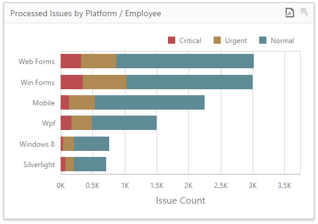

# Chart
The topics in this section describe the features available in the **Chart** dashboard item, and provide information on how to create and customize charts in the Web Dashboard.

This section is divided into the following subsections.
* [Providing Data](../../../../dashboard-for-web/articles/web-dashboard-designer-mode/designing-dashboard-items/chart/providing-data.md)
	
	Provides information on how to supply the Chart dashboard item with data.
* [Series](../../../../dashboard-for-web/articles/web-dashboard-designer-mode/designing-dashboard-items/chart/series.md)
	
	Enumerates and describes different types of series that can be displayed within the Chart dashboard item.
* [Panes](../../../../dashboard-for-web/articles/web-dashboard-designer-mode/designing-dashboard-items/chart/panes.md)
	
	Introduces the concept of chart panes (visual areas within a diagram that display chart series), and provides information on how to create them.
* [Interactivity](../../../../dashboard-for-web/articles/web-dashboard-designer-mode/designing-dashboard-items/chart/interactivity.md)
	
	Describes features that enable interaction between the Chart and other dashboard items.
* [Legend](../../../../dashboard-for-web/articles/web-dashboard-designer-mode/designing-dashboard-items/chart/legend.md)
	
	Provides information about the chart legend and its options.
* [Axes](../../../../dashboard-for-web/articles/web-dashboard-designer-mode/designing-dashboard-items/chart/axes.md)
	
	Describes how to customize settings related to chart axes.
* [Orientation](../../../../dashboard-for-web/articles/web-dashboard-designer-mode/designing-dashboard-items/chart/orientation.md)
	
	Describes how to toggle the chart's orientation.