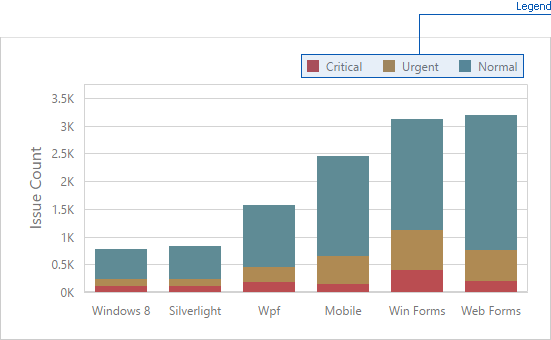

# Legend
A legend is an element of a chart that identifies chart series and series points.

To customize legend options, go to the Chart's [Options](../../ui-elements/dashboard-item-menu.md) menu and open the **Legend** section.

The following settings are available.
* The **Visible** option allows you to specify whether or not to show a legend.
* The **Inside Diagram** option allows you to locate a legend inside or outside the Chart.
* The **Position** option allows to set a legend's position and orientation.