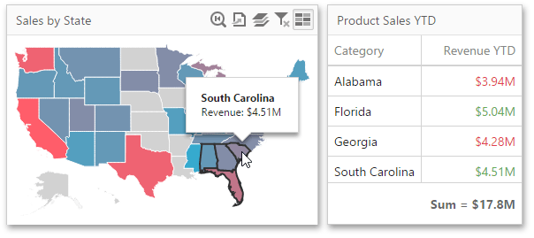

To enable interaction between the **Choropleth Map** and other dashboard items, you can use the interactivity features. These features include **Master Filtering**.

## Master Filtering
You can use the **Choropleth Map** dashboard item as a filter for other dashboard items.

The Choropleth Map dashboard item supports filtering by shapes. When Master Filtering is enabled, you can click a shape (or multiple shapes) to make other dashboard items only display data related to the selected shape(s).

To learn more about filtering concepts common to all dashboard items, see the [Master Filtering](../../../../../dashboard-for-web/articles/web-dashboard-designer-mode/interactivity/master-filtering.md) topic.

To enable **Master Filtering**, go to the Choropleth Map's [Interactivity](../../../../../dashboard-for-web/articles/web-dashboard-designer-mode/ui-elements/dashboard-item-menu.md) menu and select the required Master Filtering mode.

To reset filtering, use the **Clear Master Filter** button (the  icon) in the Choropleth Map's [caption](../../../../../dashboard-for-web/articles/web-dashboard-designer-mode/dashboard-layout/dashboard-item-caption.md).