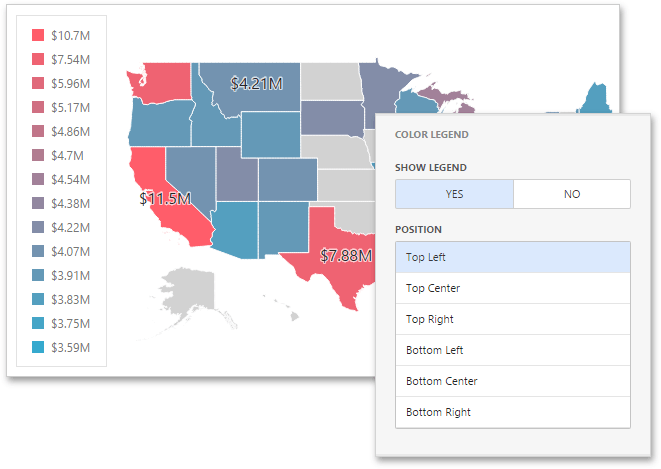

# Legend
A **legend** is an element of a map that shows values corresponding to each color.

To display a legend within a map, open the Choropleth Map's [Options](../../ui-elements/dashboard-item-menu.md) menu and go to the **Color Legend** section.

The following options are available.

| Option | Description |
|---|---|
| **Show Legend** | Allows you to control the visibility of legend. |
| **Position** | Specifies the legend's position on a map. |