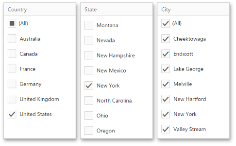

# Interactivity
This document describes filtering capabilities supported by filter elements. You can use filter elements to apply master filtering to other dashboard items or introduce hierarchical filtering by adding several connected filters.

## Master Filtering
The Dashboard allows you to use any data aware dashboard item as a filter for other dashboard items ([Master Filter](../../interactivity/master-filtering.md)).

> [!IMPORTANT]
> Note that filter elements do not support Master Filter selection modes. You can switch the selection mode by [changing the type](filter-elements-overview.md) of the required filter element.

Depending on the filter element type, you can select a value(s) to make other dashboard items display only data related to the selected value(s).

You can also create a set of related filter elements containing relevant filter values. For instance, in the image below, the _State_ filter element contains states related to the 'United States' value, while the _City_ filter element contains cities related to the 'New York' value.

Disable the **Ignore Master Filters** option in the [Interactivity](../../ui-elements/dashboard-item-menu.md) menu for the required filter element to allow the applying of filtering to this element.