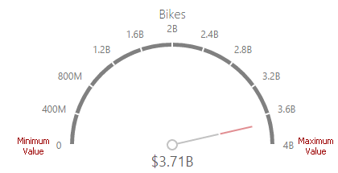

# Gauge Scale
By default, the Gauge dashboard item automatically determines the range of the gauge scales based on the values they display.

You can override this behavior and specify maximum and minimum values on the scale. After you add the data item, open the **Scale Options** section of the [data item menu](../../ui-elements/data-item-menu.md) to customize the gauge scale.

Then, set the minimum/maximum value mode to **Custom** and specify this value in the corresponding field. The image below shows a gauge with a minimum value of 1B and maximum 5B.

