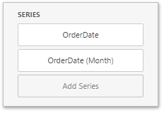

# Interactivity
To enable interaction between the Gauge and other dashboard items, you can use the interactivity features, as **Master Filtering** and **Drill-Down**.
* [Master Filtering](#masterfiltering)
* [Drill-Down](#drilldown)

## <a name="masterfiltering"/>Master Filtering
You can use the **Gauge** dashboard item as a filter for other dashboard items. To learn more about filtering concepts common to all dashboard items, see the [Master Filtering](../../interactivity/master-filtering.md) topic.

When **Master Filtering** is enabled, you can click a gauge(s) to make other dashboard items only display data related to the selected gauge(s).

To enable **Master Filtering**, go to the Gauge's [Interactivity](../../ui-elements/dashboard-item-menu.md) menu and select the required Master Filtering mode.

To reset filtering, use the **Clear Master Filter** button (the  icon) in the Gauge's [caption](../../dashboard-layout/dashboard-item-caption.md).

## <a name="drilldown"/>Drill-Down
The built-in drill-down capability allows you to change the detail level of data displayed in dashboard items on the fly. To learn more about drill-down concepts common to all dashboard items, see the [Drill-Down](../../interactivity/drill-down.md) topic.

When drill-down is enabled, you can click a gauge to view the details.

Drill-down requires that the **Series** section contains several dimensions at the top, from the least detailed to the most detailed dimension.

> [!NOTE]
> In OLAP mode, you can perform drill-down for either a hierarchy data item or several dimension attributes.

To enable **Drill-Down**, go to the Gauge's [Interactivity](../../ui-elements/dashboard-item-menu.md) menu and turn the **Drill-Down** option on.

To return to the previous detail level, click the **Drill Up** button (the  icon) in the Gauge's [caption](../../dashboard-layout/dashboard-item-caption.md).