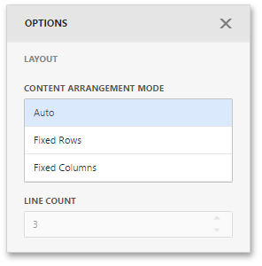

# Layout
The Gauge dashboard item allows you to specify the number of columns or rows by which gauges are arranged. For example, the following image shows gauges arranged into 3 columns.

To control how gauges are arranged, use the **Layout** section in the Gauge's [Options](../../ui-elements/dashboard-item-menu.md) menu.

The following modes are available.

| Arrangement Mode | Description |
|---|---|
| **Auto** | Automatically resizes gauges to fit within the dashboard item. |
| **Fixed Rows** | Allows you to arrange gauges in a specific number of rows. |
| **Fixed Columns** | Allows you to specify the number of columns in which gauges are arranged. |

To specify the number of rows/columns, use the **Line Count** field.