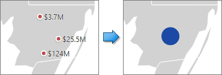

# Clustering
When a Geo Point map contains a large number of objects (callouts, bubbles or pies), showing each object individually on the map is not useful. The Web Dashboard provides the capability to group neighboring map objects. This feature is called Clustering.

For instance, the [Geo Point Map](../../../../../dashboard-for-web/articles/web-dashboard-designer-mode/designing-dashboard-items/geo-point-maps/geo-point-map.md) dashboard item combines callouts to bubbles.

The [Bubble Map](../../../../../dashboard-for-web/articles/web-dashboard-designer-mode/designing-dashboard-items/geo-point-maps/bubble-map.md) and [Pie Map](../../../../../dashboard-for-web/articles/web-dashboard-designer-mode/designing-dashboard-items/geo-point-maps/pie-map.md) dashboard items cluster bubbles/pies with other bubbles/pies.

To enable clustering in the Web Dashboard, use the **Enable Clustering** option in the Geo Point Map's [Options](../../../../../dashboard-for-web/articles/web-dashboard-designer-mode/ui-elements/dashboard-item-menu.md) menu.

