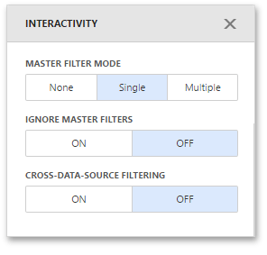

# Interactivity
This document describes the capabilities that enable interaction between **Geo Point** maps and other dashboard items. These capabilities include **Master Filtering**.

## Master Filtering
You can use the **Geo Point** dashboard item as a filter for other dashboard items.

The Geo Point Map dashboard item supports filtering by callout/bubble/pie. When Master Filtering is enabled, you can click a callout/bubble/pie (or multiple callouts/bubbles/pies) to make other dashboard items only display data related to the selected callout(s)/bubble(s)/pie(s).

> [!NOTE]
> When you select a clustered bubble or pie, master filtering is applied by all points that are clustered into this bubble/pie.

To learn more about filtering concepts common to all dashboard items, see the [Master Filtering](../../interactivity/master-filtering.md) topic.

To enable **Master Filtering**, go to the Map's [Interactivity](../../ui-elements/dashboard-item-menu.md) menu and select the required Master Filtering mode.

To reset filtering, use the **Clear Master Filter** button (the  icon) in the Map's [caption](../../dashboard-layout/dashboard-item-caption.md).