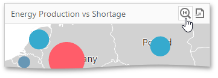

# Map Navigation
The Geo Point Map dashboard item allows you to perform navigation actions such as zooming and scrolling using the mouse.

You can enable or disable the capability to scroll/zoom the map using the **Lock Navigation** option in the Geo Point Map's [Options](../../ui-elements/dashboard-item-menu.md) menu.

To display the entire map within the dashboard item, use the **Initial Extent** button (the  icon) in the Geo Point Map's [caption](../../dashboard-layout/dashboard-item-caption.md).

