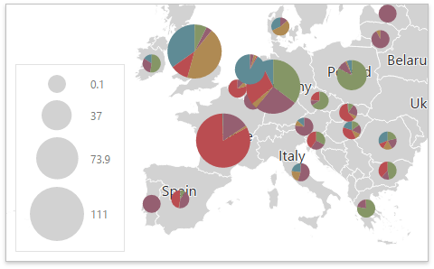

# Pie Map
The **Pie Map** dashboard item allows you to display pies on the map. Each pie visualizes the contribution of each value to the total.

Topics in this section describe specific capabilities of the **Pie Map** dashboard item.
* [Providing Data](pie-map/providing-data.md)
	
	Describes how to supply the Pie Map with data.
* [Pie Options](pie-map/pie-options.md)
	
	Describes the specific options of the Pie Map dashboard item.
* [Coloring](pie-map/coloring.md)
	
	Describes the capability to manage coloring of the Pie Map.
* [Legends](pie-map/legends.md)
	
	Describes the available Pie Map legends and their options.