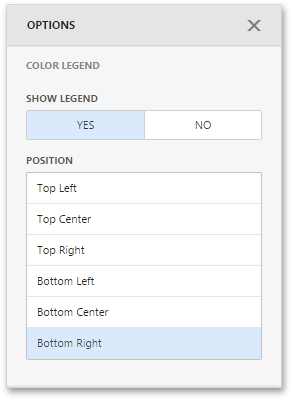

The Pie Map provides two types of legends used to identify map objects - **color** and **weighted** legends.

## Color Legend
The color legend helps you identify which colors correspond to specific argument values.

To specify color legend settings, go to the **Color Legend** section of the Pie Map's [Options](../../../../../../dashboard-for-web/articles/web-dashboard-designer-mode/ui-elements/dashboard-item-menu.md) menu.

Here you can show or hide the color legend and change its position.

## Weighted Legend
The weighted legend allows you to identify values corresponding to specific pie sizes.

To specify weighted legend's settings, go to the **Weighted Legend** section of the Pie Map's [Options](../../../../../../dashboard-for-web/articles/web-dashboard-designer-mode/ui-elements/dashboard-item-menu.md) menu.

Here you can show or hide the weighted legend and change its position.