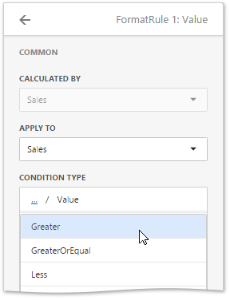
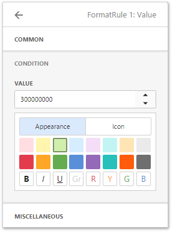
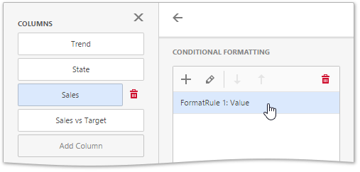

# Conditional Formatting
The Grid dashboard item supports the conditional formatting feature that provides the capability to apply formatting to grid cells whose values meet the specified condition. This feature allows you to highlight specific cells or entire rows using a predefined set of rules. To learn more about conditional formatting concepts common for all dashboard items, see [Conditional Formatting](../../../../../dashboard-for-web/articles/web-dashboard-designer-mode/appearance-customization/conditional-formatting.md).

The Grid dashboard item allows you to apply conditional formatting to data items providing data to the **dimension** and **measure** [column types](../../../../../dashboard-for-web/articles/web-dashboard-designer-mode/designing-dashboard-items/grid/columns.md).

You can use [hidden measures](../../../../../dashboard-for-web/articles/web-dashboard-designer-mode/binding-dashboard-items-to-data/hidden-data-items.md) to specify a condition used to apply formatting to visible values. New appearance settings are applied to grid cells corresponding to the target dimension/measure values.

## Create and Edit Format Rules
To create a new format rule, select the required measure / dimension by whose values a format condition will be calculated, open its [menu](../../../../../dashboard-for-web/articles/web-dashboard-designer-mode/ui-elements/data-item-menu.md) and go to the **Conditional Formatting** section. Click "+" to add a new rule.

 

Then, specify the data item to which conditional formatting is applied using the **Apply to** combo box and select the condition type.

 

Depending on the selected format condition, the menu used to create a format rule for a Grid contains different settings. For example, the image below displays the _Value_ format condition menu. Here you need to specify a required value and select a format rule style.

> The **Miscellaneous** section of the format rule menu contains additional settings, depending on the dashboard item type. The Grid dashboard item allows you to apply the current format rule to a row or disable this rule.

 

The format condition is now ready and will be applied to the Grid dashboard item.

To edit a format rule, open the **Conditional Formatting** section of the [data item menu](../../../../../dashboard-for-web/articles/web-dashboard-designer-mode/ui-elements/data-item-menu.md), select the required format rule and click the **Edit** button (the  icon).

To delete the selected format rule, click the **Delete** button (the  icon).