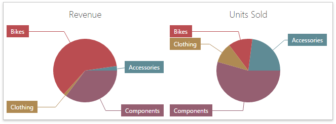

The Pie dashboard item displays a series of pies or donuts that represent the contribution of each value to a total.

This section consists of the following subsections.
* [Providing Data](../../../../dashboard-for-web/articles/web-dashboard-designer-mode/designing-dashboard-items/pies/providing-data.md)
	
	Describes how to supply the Pie dashboard item with data.
* [Interactivity](../../../../dashboard-for-web/articles/web-dashboard-designer-mode/designing-dashboard-items/pies/interactivity.md)
	
	Describes features that enable interaction between the Pie dashboard item and other items.
* [Layout](../../../../dashboard-for-web/articles/web-dashboard-designer-mode/designing-dashboard-items/pies/layout.md)
	
	Describes layout options of the Pie dashboard item.
* [Labels](../../../../dashboard-for-web/articles/web-dashboard-designer-mode/designing-dashboard-items/pies/labels.md)
	
	Explains how to customize data labels and tooltips.
* [Style](../../../../dashboard-for-web/articles/web-dashboard-designer-mode/designing-dashboard-items/pies/style.md)
	
	Describes how to select the style of pie charts.