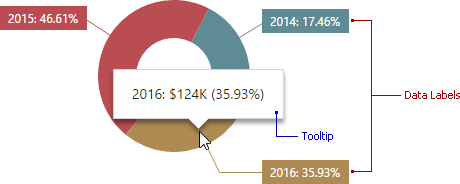

# Labels
Pies display **data labels** that contain descriptions for pie segments, and provide **tooltips** with additional information.

To configure data labels and tooltips, open the Pie's [Options](../../ui-elements/dashboard-item-menu.md) menu and go to the **Labels** section.

 

Here you can set argument, value, percent or their combinations as data labels or tooltips.