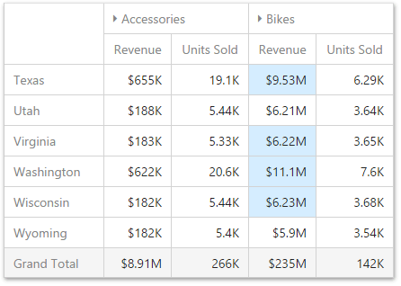

# Conditional Formatting
The Pivot dashboard item supports the conditional formatting feature that provides the capability to apply formatting to data cells whose values meet the specified condition. This feature allows you to highlight specific cells or entire rows/columns using a predefined set of rules. To learn more about conditional formatting concepts common for all dashboard items, see [Conditional Formatting](../../../../../dashboard-for-web/articles/web-dashboard-designer-mode/appearance-customization/conditional-formatting.md).

The Pivot dashboard item allows you to use conditional formatting for measures placed in the **Values** section and dimensions placed in the **Columns/Rows** sections.

You can use [hidden measures](../../../../../dashboard-for-web/articles/web-dashboard-designer-mode/binding-dashboard-items-to-data/hidden-data-items.md) to specify a condition used to apply formatting to visible values. New appearance settings are applied to data cells corresponding to a row/column intersection. You can set the intersection of the row and column manually or use predefined settings.

## Create and Edit Format Rules
To create a new format rule for the Pivot's dimension/measure, select the required data item by whose values a format condition will be calculated, open its menu and go to the **Conditional Formatting** section. Click "+" to add a new rule.

Then, specify the data item to which conditional formatting is applied using the **Apply to** combo box and select the condition type.

Depending on the selected format condition, the menu used to create a format rule for Pivot contains different settings. For example, the image below displays the _Top/Bottom_ format condition menu. Here, you need to specify the number of values to be displayed and select a format rule style.

> The **Miscellaneous** section of the format rule menu contains additional settings depending on the dashboard item type. The Pivot dashboard item allows you to manually specify an intersection level or disable the current rule.

The format condition is now ready and will be applied to the Pivot dashboard item.

To edit a format rule, open the **Conditional Formatting** section of the [data item menu](../../../../../dashboard-for-web/articles/web-dashboard-designer-mode/ui-elements/data-item-menu.md), select the required format rule and click the **Edit** button (the  icon).

To delete the selected format rule, click the **Delete** button (the  icon).