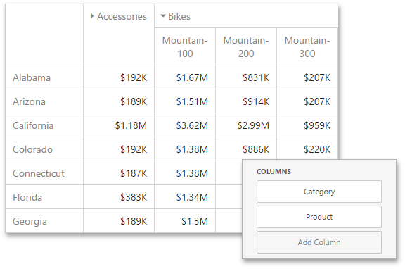

# Expanded State
If the [Columns or Rows](../../../../../dashboard-for-web/articles/web-dashboard-designer-mode/designing-dashboard-items/pivot/providing-data.md) section contains several data items, the Pivot column and row headers are arranged in a hierarchy and make up column and row groups.

You can collapse and expand row and column groups using the  and  buttons. However, the current expanded state of column and row groups do not save in the dashboard definition. If necessary, you can specify the default expanded state using the following options from **[Options menu](../../../../../dashboard-for-web/articles/web-dashboard-designer-mode/ui-elements/dashboard-item-menu.md)** | **Initial State**:
* **Auto Expanded Column Groups** - Specifies whether column groups should be collapsed or expanded by default;
* **Auto Expanded Row Groups** - Specifies whether row groups should be collapsed or expanded by default.