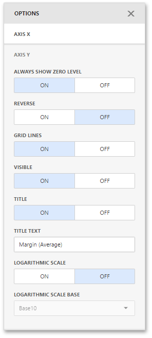

# Axes
Scatter Chart X and Y-axes are numerical axis of values. You can specify various axes settings to change visual data presentation.

To access X and Y-axis settings, go to the Scatter Chart's [Options](../../ui-elements/dashboard-item-menu.md) menu and open the **Axis X** or **Axis Y** section.

Here you can configure the visibility of axes, their title and grid lines, reverse the axes, etc.

The following options are available.

| Options | Description |
|---|---|
| **Always show zero level** | Specifies whether or not the axis' zero level is visible. If this option is unchecked, the visible axis range is defined based on the values plotted in the chart. Note that the **Axis X** section does not contain the **Always show zero level** option. |
| **Reverse** | Allows you to reverse the axis. If the axis is reversed, its values are ordered from top to down. |
| **Grid Lines** | Allows you to hide and show grid lines for the axis. |
| **Visible** | Allows you to hide and show the axis. |
| **Title** | Allows you to hide and show the axis title. You can choose whether to use the default text or specify a custom string using the **Title Text** option. |
| **Logarithmic scale** | Specifies whether or not the axis should display its numerical values using a logarithmic scale. The combo box next to this option allows you to select the logarithmic base from one of the predefined values. |