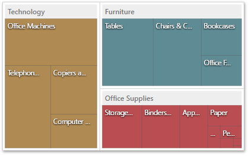

# Treemap
The **Treemap** dashboard item allows you to visualize data in nested rectangles that are called _tiles_.

This section consists of the following topics.
* [Providing Data](treemap/providing-data.md)
	
	Provides information on how to supply the Treemap dashboard item with data.
* [Interactivity](treemap/interactivity.md)
	
	Describes features that enable interaction between the Treemap and other dashboard items.
* [Layout](treemap/layout.md)
	
	Describes layout options of the Card dashboard item.
* [Grouping](treemap/grouping.md)
	
	Describes how to group Treemap tiles intro groups.
* [Coloring](treemap/coloring.md)
	
	Provides information about coloring.
* [Labels](treemap/labels.md)
	
	Provides information about labels and tooltips that contain descriptions of tiles.