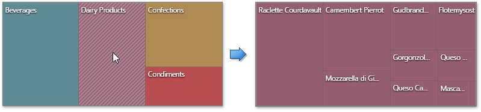

To enable interaction between the Treemap and other dashboard items, you can use the interactivity features, as **Master Filtering** and **Drill-Down**.
* [Master Filtering](#masterfiltering)
* [Drill-Down](#drilldown)

## <a name="masterfiltering"/>Master-Filtering
The Web Dashboard allows you to use any data aware dashboard item as a filter for other dashboard items (Master Filter). To learn more about filtering concepts common to all dashboard items, see the [Master Filtering](../../../../../dashboard-for-web/articles/web-dashboard-designer-mode/interactivity/master-filtering.md) topic.

The Treemap dashboard item supports filtering by tiles/[groups](../../../../../dashboard-for-web/articles/web-dashboard-designer-mode/designing-dashboard-items/treemap/grouping.md).

When **Master Filtering** is enabled, you can click a tile or group caption (or multiple tiles/groups) to make other dashboard items only display data related to the selected tile/group(s).

> If the Single Master Filter is used, you can select only tiles corresponding to the bottommost level.

To enable **Master Filtering**, go to the Treemap's [Interactivity](../../../../../dashboard-for-web/articles/web-dashboard-designer-mode/ui-elements/dashboard-item-menu.md) menu and select the required Master Filtering mode.

To reset multiple filtering, use the **Clear Master Filter** button (the  icon) in the Treemap's [caption](../../../../../dashboard-for-web/articles/web-dashboard-designer-mode/dashboard-layout/dashboard-item-caption.md).

## <a name="drilldown"/>Drill-Down
The built-in drill-down capability allows end-users to change the detail level of data displayed in dashboard items on the fly. To learn more about drill-down concepts common to all dashboard items, see the [Drill-Down](../../../../../dashboard-for-web/articles/web-dashboard-designer-mode/interactivity/drill-down.md) topic.

When drill-down is enabled, an end-user can click a tile to view the details.

Drill-down requires that the **Arguments** section contains several dimensions at the top, from the least detailed to the most detailed dimension.

> In OLAP mode, you can perform drill-down for either a hierarchy data item or several dimension attributes.

To enable **Drill-Down**, go to the Treemap's [Interactivity](../../../../../dashboard-for-web/articles/web-dashboard-designer-mode/ui-elements/dashboard-item-menu.md) menu and turn the **Drill-Down** option on.

To return to the previous detail level, click the **Drill Up** button (the  icon) in the Treemap's [caption](../../../../../dashboard-for-web/articles/web-dashboard-designer-mode/dashboard-layout/dashboard-item-caption.md).

> [Grouping](../../../../../dashboard-for-web/articles/web-dashboard-designer-mode/designing-dashboard-items/treemap/grouping.md) is not in effect when drill-down is enabled.