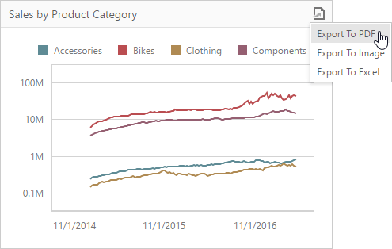

# Exporting
The Web Dashboard allows you to export an entire dashboard or individual [dashboard items](dashboard-item-settings.md). You can export the dashboard/dashboard items to PDF and Image formats; additionally, you can export dashboard item's data to Excel/CSV.
* [Exporting Dashboards](#exportingdashboards)
* [Exporting Dashboard Items](#exportingdashboarditems)

## <a name="exportingdashboards"/>Exporting Dashboards
To export the entire dashboard, click the  button in the dashboard title area and choose the required action.

### Export to PDF

Invokes a corresponding dialog that allows you to export a dashboard to a PDF file with specific options. The following options are available:

* **File Name** - Specifies the name of the exported PDF file.
* **Page Layout** - Specifies the page orientation used to export a dashboard. You can select between _Portrait_, _Landscape_ and _Auto_. Note that in the _Auto_ mode the page orientation is selected automatically depending on the horizontal and vertical sizes of a dashboard.
* **Size** - Specifies the standard paper size (for instance, _Letter_ or _A4_).
* **Show Title** - Specifies whether or not to apply the dashboard title to the exported document title.
* **Title** - Specifies the title of the exported document.
* **Scale Mode** - Specifies the mode for scaling when exporting a dashboard.
	
	> [!NOTE]
	> Note that this option is in effect when **Page Layout** is set to value different from _Auto_.

### Export to Image

Invokes a corresponding dialog that allows you to export a dashboard to image of the specified format. The following options are available:

* **File Name** - Specifies the name of the exported Image file.
* **Show Title** - Specifies whether or not to apply the dashboard title to the exported document title.
* **Title** - Specifies the title of the exported document.
* **Image Format** - Specifies the image format in which the dashboard is exported. The following formats are available: _PNG_, _JPEG_ and _GIF_.
* **Resolution (dpi)** - Specifies the resolution (in dpi) used to export a dashboard.

### Export to Excel

Invokes a corresponding dialog that allows you to export dashboard's data to the Excel file. The following options are available:

* **File Name** - Specifies the name of the exported Excel file.
* **Excel Format** - Specifies the Excel workbook format in which the dashboard's data is exported. You can select between _XLSX_ and _XLS_.
* **Include | Filters** - Allows you to include master filter values to the exported document.
* **Include | Parameters** - Allows you to include parameter values to the exported document.
* **Position** - Specifies the position of the master filter and parameter values in the exported document. You can select between _Below_ and _Separate Sheet_.

Specify the required options in the dialog and click the **Export** button to export the dashboard. To reset the changes to the default values, click the **Reset** button.

> [!NOTE]
> If you export the entire dashboard, its current state is preserved (e.g., the [dashboard layout](dashboard-layout.md), the scroll position of individual dashboard items and selections within [master filter](interactivity/master-filtering.md) items).

## <a name="exportingdashboarditems"/>Exporting Dashboard Items
To export a dashboard item, click the  button in the dashboard item caption area and choose the required action.

* **Export to PDF** - Invokes a corresponding dialog that allows you to export a dashboard to a PDF file with specific options.
* **Export to Image** - Invokes a corresponding dialog that allows you to export a dashboard to image of the specified format.
* **Export to Excel** - Invokes a corresponding dialog that allows you to export a dashboard item's data to the Excel workbook or CSV file.

To learn more about exporting specifics of different dashboard items, see the **Exporting** topic for the required [dashboard item](../web-dashboard-viewer-mode/dashboard-items.md).

> [!NOTE]
> When an individual dashboard item is printed, the entire item's content is reflected in the printed document regardless of the item's current scroll position.