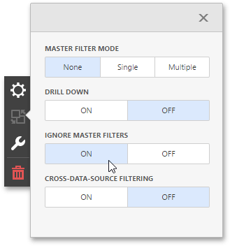

The Dashboard allows you to use any data aware dashboard item as a filter for other dashboard items. This feature is called **Master Filtering**. You can select elements in a Master Filter item (grid records, chart bars, pie segments, etc.) to filter data in other dashboard items by the selected values.
* [Master Filter Modes](#modes)
* [Filtering Across Data Sources](#across)
* [Preventing Items from Being Filtered](#ignore)

## <a name="modes"/>Master Filter Modes
To enable master filtering, go to the dashboard item's **Interactivity** menu and use the **Master Filtering Mode** option.

The Master Filter item supports the following modes.
* **None** - Disables master filtering.
* **Multiple** - Allows you to select multiple elements in the Master Filter item. To reset filtering, use the **Clear Master Filter** button (the  icon) in the dashboard item's caption.
* **Single** - Allows you to select only one element in the Master Filter item. When this mode is enabled, the default selection will be set to a Master Filter element. You can change this selection, but cannot clear it.

To disable the Master Filter, select **None** as a Master Filter mode.

## <a name="across"/>Filtering Across Data Sources
When different items in a dashboard are bound to different data sources, you can specify that a particular Master Filter should be applied across data sources. This means that it will apply filtering to fields with matching names in all data sources.

To filter data across data sources, enable the **Cross-Data-Source Filtering** in the dashboard item's **Interactivity** menu.

## <a name="ignore"/>Preventing Items from Being Filtered
You can prevent specific dashboard items from being affected by Master Filters. To do this, enable the **Ignore Master Filters** option in the dashboard item's **Interactivity** menu.

