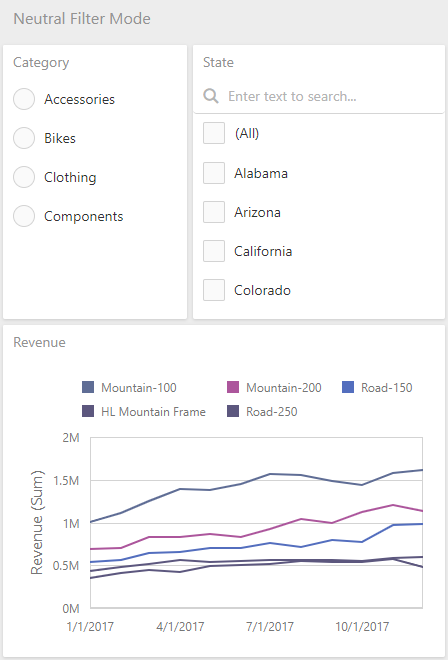
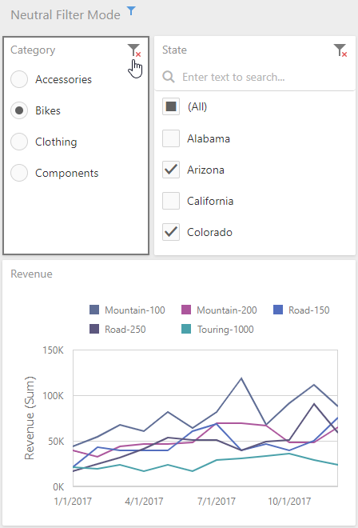

# Neutral Filter Mode

The [filter elements](../dashboard-item-settings/filter-elements.md) show all items selected by default, to indicate that no filtering is currently taking place. Starting from this state, users typically begin each filtering operation by deselecting **All**, before they select individual items.

An extra click is required to begin any actual filtering operation, because the **standard filter mode** shows all items selected. This is not an optimal implementation for performance reasons, because it generates filtering criteria that are evaluated by the data layer and/or the database.

To solve these issues, the **Neutral Filter Mode** is implemented. It is neutral in the sense that it does not apply any criteria to the data source in its default state, resulting in improved performance.

All items are shown deselected. This means that an extra click is no longer required in the most common scenarios, and this behavior is familiar to end users from websites world-wide.

The **Neutral Filter Mode** helps in a situation when there is a potential “dead lock”, due to the fact that multiple filter elements influence each other. The **Clear Master Filter** button resets the filters.

